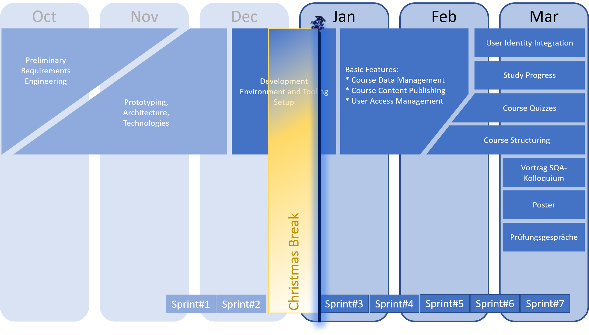

 
 

# IT-REX Newsletter #3

Published: Jan 07, 2021

 

## Roadmap

We're concluding the set-up of the development environment and tools while implementing basic functionality. See our newly refined roadmap below:

## Sprint Goal Overview:
* **Last sprint** -- No current sprint due to Christmas break --
* **Current sprint** (started jan 07, 2021): All or in!?

## Latest Achievements

* We enjoyed the Christmas break :-)
* We stayed safe from COVID-19
* (See [last newsletter](https://github.com/IT-REX-Platform/Wiki/blob/main/newsletter/archive/2020-12-23.md) for achievements of the previous sprint.)

## Next Steps

* Finishing the set-up of our **CI pipeline** including tooling for quality assurance and an experimental deployment environment
* Basic project set-up for the backend components
* Basic functionality for **creating courses**
* Basic functionality for **uploading videos**
* Contact **OpenCast** people at the University of Stuttgart to gain insights on OpenCast, ILIAS, etc.

## [Newsletter-Archive](https://github.com/IT-REX-Platform/Wiki/tree/main/newsletter/archive)