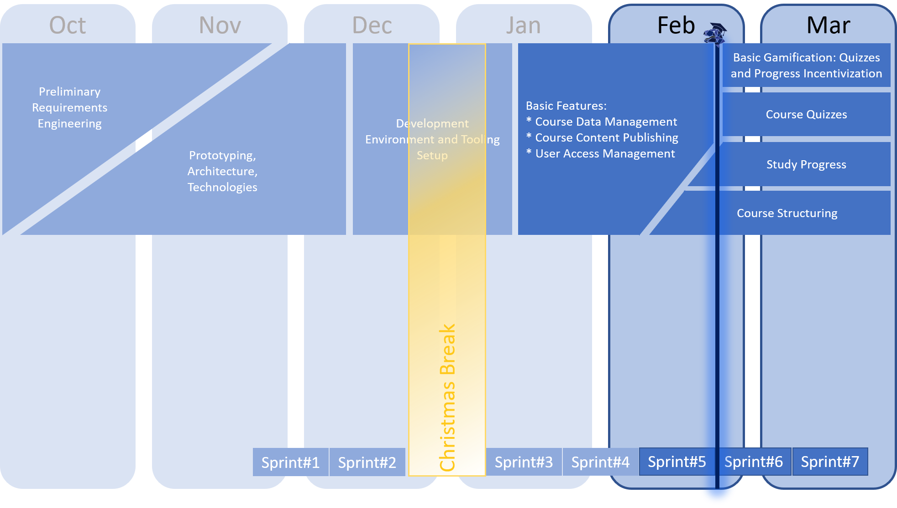
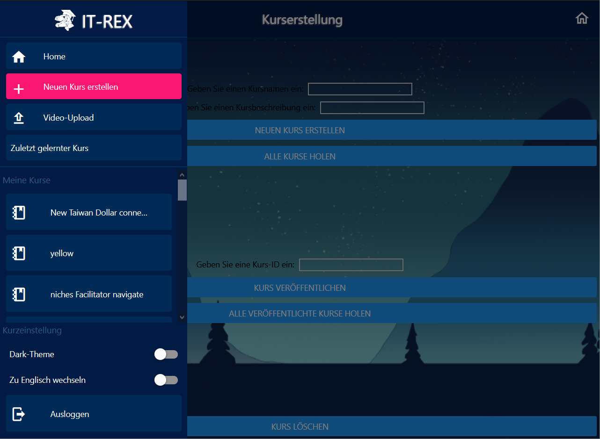

 
 

# IT-REX Newsletter #5

Published: Feb 17, 2021

 

## Roadmap

After being able to create courses and upload videos, some architectural refinements and overcoming technical difficulties, we're continuing to knit the functionality together in our UI with newly created navigation elements. 

## Sprint Goal Overview:
* **Last sprint** (finished Feb 16, 2021): Architecture Alignment
* **Current sprint** (started Feb 17, 2021): Let's structure it!

## Latest Achievements
* Aligned the development efforts to the planned architecture and specified our strategy of implementing the runtime behaviour. See the [Architecture Documentation](https://github.com/IT-REX-Platform/Wiki/wiki/Application-Architecture) with [Implementation View](https://github.com/IT-REX-Platform/Wiki/wiki/Application-Architecture--Implementation-View) and [Runtime View](https://github.com/IT-REX-Platform/Wiki/wiki/Application-Architecture--Runtime-View). 
* Reinvented our backend development process with JHipster: [How to Microservices with JHipster](https://github.com/IT-REX-Platform/Wiki/wiki/Development--How-to-JHipster-Microservices).
* Implemented the foundations for the navigation in the IT-REX User Interface: 
  

## Next Steps
* Adjust the testing strategy in the Frontend to be more efficient in the development process.
* Structure a course and enable lecturers to easily upload their content into a course. 
* Get authorization in every part of our application: Protect the endpoints, enable and disable according UI elements and streamline the user experience. 

## [Newsletter-Archive](https://github.com/IT-REX-Platform/Wiki/tree/main/newsletter/archive)