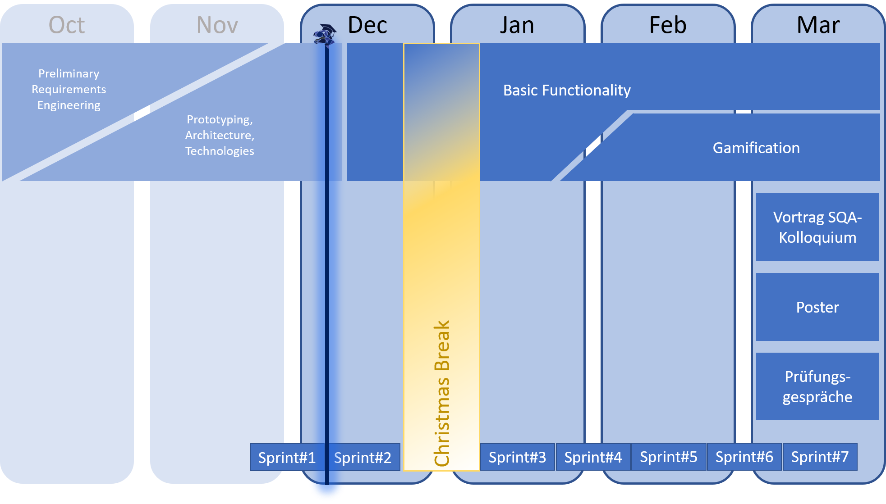

 
 

# IT-REX Newsletter #1

Published: Dec 10, 2020

 

## Roadmap

The IT-REX project is finally entering the implementation phase. The roadmap below visualizes the current project state with respect to the overall scope and duration: We're starting to implement the first basic functionality! :-)

## Sprint Goal Overview:
* **Last sprint** (finished Dec 08, 2020): Finish the prototyping phase, define the application architecture and all relevent things to start the actual development. 
* **Current sprint** (started Dec 09, 2020): Bring IT-REX to life with first basic functionality!

## Latest Achievements

* Definition of an **Architecture Baseline**: An overall baseline for the application architecture was created to define a first skeleton for the platform implementation. See details about the [Implementation View](https://github.com/IT-REX-Platform/Wiki/wiki/Application-Architecture--Implementation-View). 
* Application **Technology Stack**: The decision for the major client layer technology has already been made based on extensive testing and research: IT-REX will be presented to the treasured user both in the web and on mobile platforms using Expo. See details in [Cross Platform Framework Documentation](https://github.com/IT-REX-Platform/Wiki/wiki/Technical-Research--Cross-Platform-Framework). Decisions for technologies to be used on server layer and data layer are about to be made, but research is still ongoing.
* Design of a preliminary **Data Model**: The [Data Model](https://github.com/IT-REX-Platform/Wiki/wiki/Application-Architecture--Data-Model) was developed to provide a first, high-level design of the solution space tackling the domain of online learning. One main focus topic was designing a model for courses to be structured both logically and timely.
* Integration of **Learning Management Systems (LMS)**: A detailed assessment of the APIs provided by [ILIAS](https://github.com/IT-REX-Platform/Wiki/wiki/Technical-Research--ILIAS-API) and [Moodle](https://github.com/IT-REX-Platform/Wiki/wiki/Technical-Research--Moodle-API) was conducted to verify where integration could be beneficial. Most notably, the feasibility of reusing course details as well as course membership data originating from these systems was approved.

## Next Steps

* Complete the technology stack (server layer and data layer)
* Define quality assurance strategy and methods
* Set up development and operation infrastructure
* Evaluate solutions for user access management
* Implement first functionality: course creation
