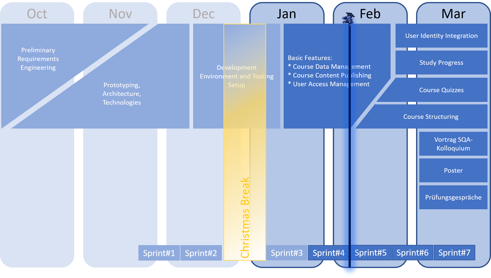

 
 

# IT-REX Newsletter #5

Published: Feb 03, 2021

 

## Roadmap

We're finishing up the most basic functionality and starting to put it together for the user: create courses, upload videos and watch them :-)

## Sprint Goal Overview:
* **Last sprint** (finished Feb 02, 2021): All about Courses & Videos
* **Current sprint** (started Feb 03, 2021): Architecture Alignment

## Latest Achievements
* Refactored client app to support multiple UI languages
* Fixed development set-up and refined the development process
* Implemented first video upload and streaming functionality
* Enabled log-in as different users to access a student and lecturer-specific homescreen 
* Tremendously improved understanding of technologies in use

## Next Steps
* Still working on filling knowledge and skill gaps
* Architecture refinement and detailing: focus topics are service-to-service communication and authentication* Implement video upload to our OpenCast instance
* First functionality using user access management: let a student join a course
* Add navigation elements to the user interface

## [Newsletter-Archive](https://github.com/IT-REX-Platform/Wiki/tree/main/newsletter/archive)