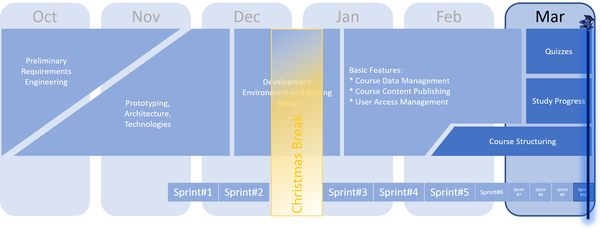

 
 

# IT-REX Newsletter #7

Published: Mar 31, 2021

 

Today, on March 31st, the "Entwicklungsprojekt" officially concludes. We decided to publish another newsletter wrapping up the most important information as a short, final summary.

## Project Overview
After Feb 15, 2021 we switched into a weekly rythm of short planning sessions and direct reviews with our supervisors/customers. During this time, the newsletter was paused due to this weekly exchange. 

With the weekly rythm, we attempted to speed up the development process and omitted a detailed sprint planning and review like we used to do before. The weekly rythm is now also visualized in our updated, final version of the project roadmap.

## Roadmap

## Release
The release 1.0.0 was created today, March 31, 2021, and is reflected in all parts of our codebase as well as running in our CD-environment: [Login to our live-system now! :smiley:](http://129.69.217.173:8085/)

## Guides and Manuals
We wrote some manuals to briefly document setting up and using IT-REX with its current release 1.0.0.
* [How to operate IT-REX](https://github.com/IT-REX-Platform/Wiki/wiki/How-to-operate-IT-REX)
* [How to use IT-REX](https://github.com/IT-REX-Platform/Wiki/wiki/How-to-use-IT-REX)
  * [...as a lecturer](https://github.com/IT-REX-Platform/Wiki/wiki/How-to-use-IT-REX--Lecturer)
  * [...as a student](https://github.com/IT-REX-Platform/Wiki/wiki/How-to-use-IT-REX--Student)

## Latest Achievements
The latest achievements are best visible by using the system or reading the guides above. So just a short summary here:
* Quizzes can be created and solved, supporting single choice, multiple choice and numeric answers.
* Courses can be structured and filled with content!
  * Define the logical structure of a course by creating chapters and adding vidoes and quizzes to them.
  * Create a course timeline by scheduling any content for a specific week of your course.
* Students can use the combined structure-and-timeline view to quickly get an overview about the course.
* Students can navigate through all contents, watch videos and solve quizzes.
* The progress of all videos is stored per user indicating how much a student has left to do in a particular course.
  

## Curtain Call
Thank you very much, dear IT-REX developers, for your commitment, time and effort! :muscle: Thank you Anna, Benedikt, Christian, Daniel, Katja, Niklas, Noel, Marko, Marcel, Marcel, Philipp and Slawa!

Thanks also to David for onwing the project. :blush:

Thank you dear Sandro, Steffen and Uwe for your inputs and especially the close cooperation in the past two months. :smiley:

And finally, thanks to our scrum masters Jan and Raoul for their continuous support during the project and the organization and moderation of our concluding retrospective meeting today! :clap:

## [Newsletter-Archive](https://github.com/IT-REX-Platform/Wiki/tree/main/newsletter/archive)