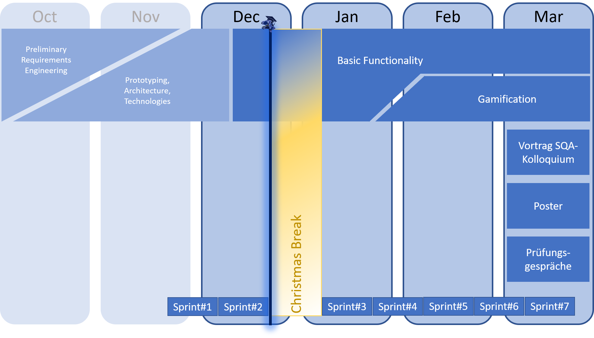

 
 

# IT-REX Newsletter #2

Published: Dec 23, 2020

 

## Roadmap

We're currently implementing first basic functionality, while further refining the architecture to adhere to requirements regarding deployment and operation. See our roadmap below:

## Sprint Goal Overview:
* **Last sprint** (finished Dec 22, 2020): Bring IT-REX to life with first basic functionality!
* **Current sprint** -- No current sprint due to Christmas break --

## Latest Achievements

* Definition of **Quality Assurance Methods and Tools**: 
* Set-up of a **Continuous Integration and Deployment Toolchain**:
* Designed a **Strategy for Implementing the UI**: 
* Defined the remaining parts of the **Technology Stack**: 

## Next Steps

* Finish remaining tasks from Sprint#2
* Enjoy the Christmas Break :-)

## [Newsletter-Archive](https://github.com/IT-REX-Platform/Wiki/tree/main/newsletter/archive)