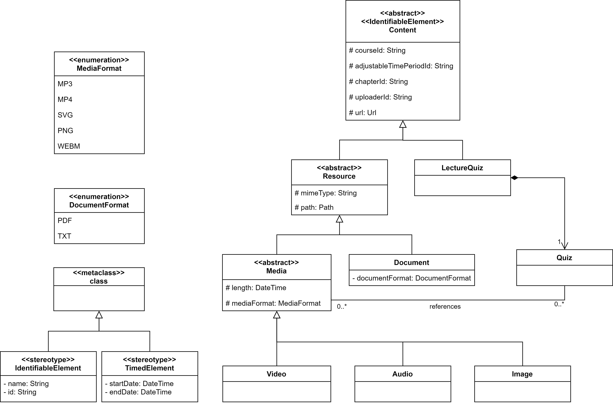

# Content Data Model

## Description

### Content

The Content class contains a url. This url is used to fetch this content item from the service that manages it. The other attributes are used to identify to which Course/AdjustabelTimePeriod/Chapter this Content belong. They are optional because there has to be no association to those elements. For more information regarding those, please refer to the [Course Structure Data Model](Application-Architecture--Data-Model--Course). Additionally there is the attribute uploaderId. It is used to identify the uploader. All other classes of Contents inherit from this class. 

### Resource

Resources are elements that are all contents that are not a LectureQuiz (i.e. Video, Audio, Images and Documents). They contain a MIME-Type which is needed so that a browser can identify what kind of data they are. This is a string because there are hundreds of those. Additionally there is a path which is used to identify where this element can be found in the filesystem (provided that we use the filesystem and no other kind of storage system to use store them). This path must be different enough from the url of the Content (see [Content](Application-Architecture--Data-Model--Content#content))

### Media

Media Contents contain a MediaFormat. This is used to know what the format of the Content is. It additionally stores the resolution of the file.

### MediaFormat

This enum contains all media formats our plattform knows and allows.

### Video

This Content describes a video file. It contains the length of it.

### Audio

This Content describes an audio file. It contains the length of it.

### Image

This Content describes an image file.

### Document

Document Contents contain a DocumentFormat. This is used to know what the format of the Content is.

### DocumentFormat

This enum contains all document formats our plattform knows and allows.

### LectureQuiz

A LectureQuiz is the Quiz that can be attached to a Chapter. Please refer to the [Quiz Data Model](Application-Architecture--Data-Model--Quiz#lecturequiz) and the [Course Structure Data Model](Application-Architecture--Data-Model--Course#lecturequiz) for more information.

### Quiz

Please refer to the [Quiz Data Model](Application-Architecture--Data-Model--Quiz#quiz) for more information.

### Question

A Question can refer to Media contents to display them. For further information on the question refer to the [Quiz Data Model](Application-Architecture--Data-Model--Quiz#question).