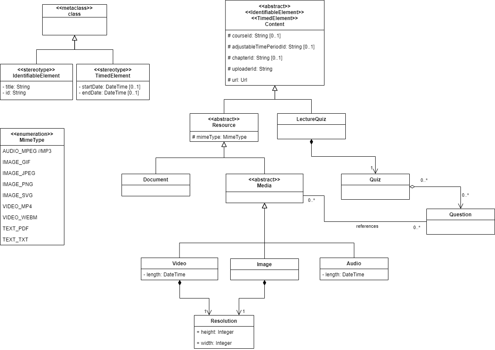

# Content Data Model

## Description

### Content

The Content class contains a url. This url is used to fetch this content item from the service that manages it. The other attributes are used to identify to which Course/AdjustabelTimePeriod/Chapter this Content belong. They are optional because there has to be no association to those elements. For more information regarding those, please refer to the [Course Structure Data Model](Application-Architecture--Data-Model--Course). Additionally there is the attribute uploaderId. It is used to identify the uploader. All other classes of Contents inherit from this class.

### Resource

Resources are elements that are all contents that are not a LectureQuiz (i.e. Video, Audio, Images and Documents). They contain a MimeType which is needed so that a browser can identify what kind of data they are. This is an enum with all the allowed types and subtypes.

### Document

This Content describes a document file.

### Media

Abstract class to encapsulate similarities of inheriting classes. It is not actually implemented as an entity and only serves for a better overview.

### Video

This Content describes a video file. It contains the length and Resolution of it.

### Image

This Content describes an image file. It contains the Resolution of it.

### Audio

This Content describes an audio file. It contains the length of it.

### LectureQuiz

A LectureQuiz is the Quiz that can be attached to a Chapter. Please refer to the [Quiz Data Model](Application-Architecture--Data-Model--Quiz#lecturequiz) and the [Course Structure Data Model](Application-Architecture--Data-Model--Course#lecturequiz) for more information.

### Quiz

Please refer to the [Quiz Data Model](Application-Architecture--Data-Model--Quiz#quiz) for more information.

### Question

A Question can refer to Media contents to display them. For further information on the question refer to the [Quiz Data Model](Application-Architecture--Data-Model--Quiz#question).

### MimeType

An enumeration containing the supported MimeTypes of the system. It consists of a type and a subtype. The type is the kind of media and refers to a specific domain entity (AUDIO -> Audio, IMAGE -> Image, VIDEO -> Video, TEXT -> Document). The subtype are the supported file types. For more information on Mime Types refer to https://developer.mozilla.org/en-US/docs/Web/HTTP/Basics_of_HTTP/MIME_types
