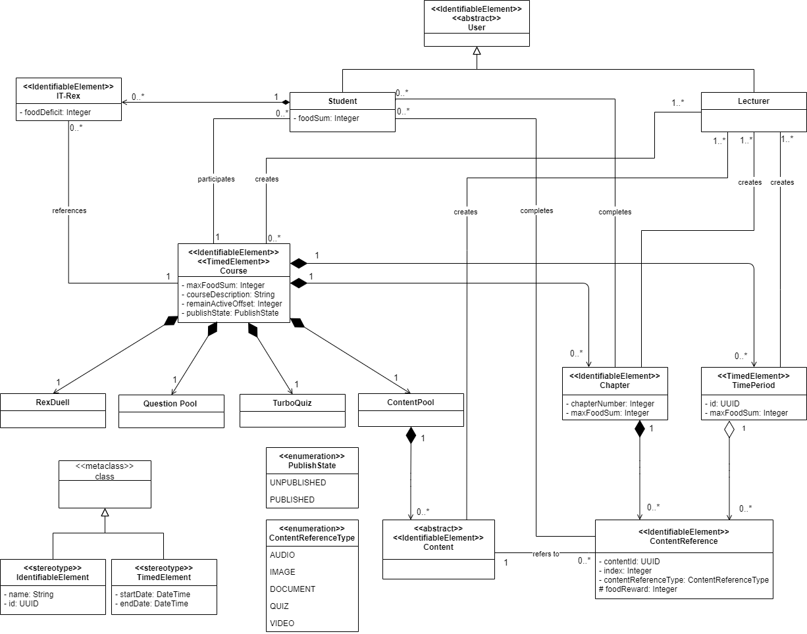

# Course Structure Data Model

## Description

### IdentifiableElement

An IdentifiableElement has a name and an id. The id is used to identify an entity globally and uses a "Universally Unique Identifier" as data type (see https://www.uuidgenerator.net/). It is used as a Stereotype on other components.

### TimedElement

A TimedElement has a startDate and an endDate. They describe when the element becomes visible to the Student and when the Student is supposed to complete the Element. It is used as a Stereotype on other components.

### Course

The Course is the most important element of this model. It consists of a logical and temporal part, represented by the Chapter and the TimePeriod respectively. The Course has a startDate and an endDate as fields. The contained TimePeriods can only start and end between those two dates. The Course also contains the maxFoodSum and a courseDescription. The former is the maximum sum of food that can be earned for the IT-Rex over the entire runtime of the course. The field remainActiveOffset indicates how long the Course remains active after the specified end date. The publishState indicates whether the Course is published and can be found by the Students.

### PublishState

Enumeration that indicates whether the Course is published or not. Fields:
* UNPUBLISHED: The Course is only visible to the Lecturer that created it.
* PUBLISHED: The Course is visible to all Users of IT-Rex.

### TimePeriod

The TimePeriod embodies the temporal part of the Course and is one period of time in that a student is supposed to complete a set of contents. For that it refers to a set of ContentReferences. It is identified by an id and contains a maxFoodSum. The sum of all TimePeriods maxFoodSums has to be equal to the maxFoodSum of the Course.

### Chapter

A Chapter is a collection of contents. For that it refers to a set of ContentReferences. A Student completes a chapter when all contained Content items have been completed. The order of Chapters in a Course is calculated from the start and end date of the assigned TimePeriods of contained ContentReferences. If there is no such assignment or overlaps the field chapterNumber is used to identify the order of a Chapter in a Course. The chapter has a field maxFoodSum. The sum of all Chapters maxFoodSums has to be equal to the maxFoodSum of the Course.

### ContentReference

A ContentReference is a reference to a Content that was created by the Lecturer. For that it holds a field contentId that references the id of the Content. There can be several ContentReferences for the same Content. A ContentReference can be assigned to a TimePeriod. As a consequence, it becomes available to the student when the startDate is reached and is supposed to be completed when the endDate is reached. For the order of ContentReferences in a Chapter the field index is used. It is overwritten when a ContentReference of higher index is assigned to an earlier TimePeriod. The contentReferenceType identifies the type of Content the ContentReference refers to. It has a field foodReward. The sum of all Contents foodRewards has to be equal to the maxFoodSum of the containing chapter.

### ContentReferenceType

Enumeration that indicates the type of Content the ContentReference refers to. Fields:
* AUDIO
* IMAGE
* DOCUMENT
* QUIZ
* VIDEO

### Content

A Content is created by a Lecturer in a Course and held in the ContentPool. It is an abstract entity that is implemented as one of the different ContentReferenceTypes. The lecturer can assign a Content to a Chapter. In that case a ContentReference is created that refers to the original Content. A Content can be assigned to several Chapters, therefore several ContentReferences can be created for one Content. For further information got to [Content Data Model](./Application-Architecture--Data-Model--Content#content-data-model).

### ContentPool

The ContentPool contains all Contents that belong to the Course. It is a mean to have an overview about uploaded Content and also store Content that has not been added to a Chapter. Every Course has exactly one ContentPool.

### RexDuell

Every course has exactly one RexDuell. It enables the students to compete with each other by answering questions about the Course Content. For further information go to [Quiz Data Model](./Application-Architecture--Data-Model--Quiz#quiz-data-model).

### QuestionPool

The QuestionPool contains all Questions that belong to the Course. They can be used in multiple different quizzes. Every Course has exactly one QuestionPool. For further information go to [Quiz Data Model](./Application-Architecture--Data-Model--Quiz#quiz-data-model).

### TurboQuiz

Every course has exactly one TurboQuiz. It enables the students to learn Course Content by answering quizzes with a time constraint. For further information go to [Quiz Data Model](./Application-Architecture--Data-Model--Quiz#quiz-data-model).

### IT-Rex

IT-Rex becomes hungry when a Content appears. The foodDeficit grows as much as the foodReward of that Content. The foodDeficit can be lowered by feeding IT-Rex. The IT-Rex itself is not destroyed when the course is destroyed because it is supposed to be a permanent trophy for the Student upon the end of the Course. -> clarify and bring in line with gamification ideas

### Student

Students participate in Courses and complete the contained Content and Chapters. Thereby they get rewarded with foodRewards to feed their IT-Rexes. They can also play quizzes like RexDuell and TurboQuiz to gain additional rewards. For further information go to [User Role Model](./Application-Architecture--Data-Model--User#user-role-model).

### Lecturer

Lecturers can create and delete Courses and lecture the contained Content. Every Course has at least one Lecturer. Lecturer manage Courses by creating TimePeriods and Chapters and uploading the Content. For further information go to [User Role Model](./Application-Architecture--Data-Model--User#user-role-model).

### User

For further information go to [User Role Model](./Application-Architecture--Data-Model--User#user-role-model).
