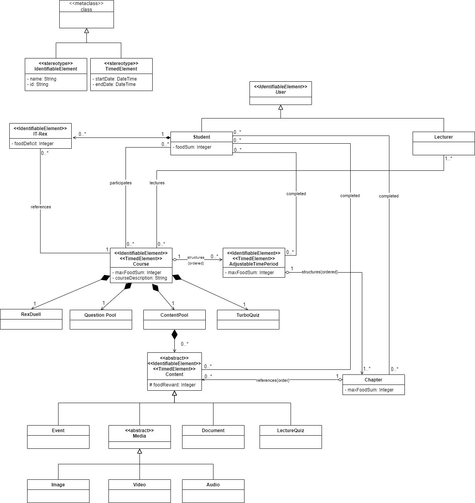
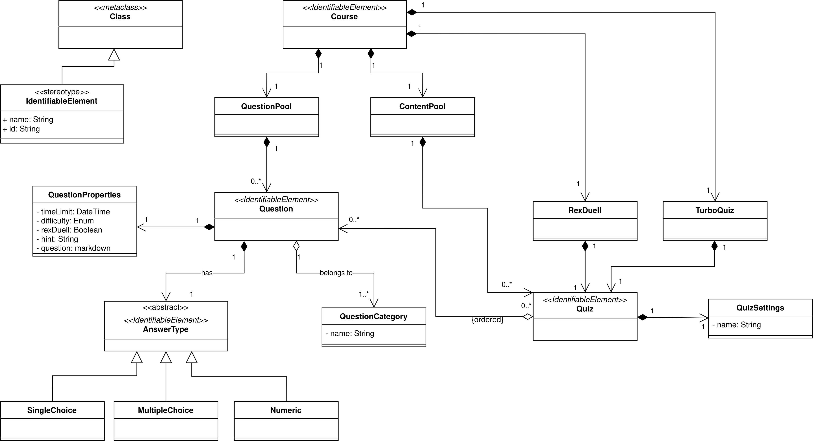

# Goal

The goal is to create an overall baseline data model spanning over the different fields of user and role model, course structure, file (meta)data model, quizzes, ...

# Course Structure Data Model

## Description

### IdentifiableElement

An IdentifiableElement has a name and an id. The id is used to identify an entity globally. It is used as a Stereotype on other components.

### TimedElement

A TimedElement has a startDate and an endDate. They describe when the element becomes visible to the Student and when the Student is supposed to complete the Element. It is used as a Stereotype on other components.

### Course

The Course is the most important element of this model. The Course has a startDate and an endDate. The contained AdjustableTimePeriods can only start and end between those two dates. The Course also contains the courseDescription and a maxFoodSum. The latter is the maximum sum of food that can be earned for the IT-Rex over the entire runtime of the course.

### AdjustableTimePeriod

The AdjustableTimePeriod embodies one period in that a student is supposed to complete a set of chapters. Those chapters can only start and end in the time frame of the AdjustableTimePeriod they belong to. All chapters are supposed to be completed when the AdjustableTimePeriod ends. It also contains a maxFoodSum. The sum of all AdjustableTimePeriods maxFoodSums has to be equal to the maxFoodSum of the Course.

### Chapter

A Chapter is a thematical collection of Contents. A chapter becomes available to the Student when the startDate is reached and is supposed to be completed when the endDate is reached. A Student completes a chapter when all contained Content items have been completed. It also contains a maxFoodSum. The sum of all Chapters maxFoodSums has to be equal to the maxFoodSum of the containing AdjustableTimePeriod.

### Content

A Content is supposed to be part of a chapter. It becomes available to the student when the startDate is reached and is supposed to be completed when the endDate is reached. It has a foodReward. The sum of all Contents foodRewards has to be equal to the maxFoodSum of the containing chapter.

### Event (experimental)

We had the idea to create a special Content type that can be used to represent any event in the Course timeline like meetings, deadlines, etc. -> include course timeline as attribute in Course?

### Media

Abstract Content type that encapsulates any content other than Documents. Examples: Video, Images, Audio.

### Document

Lecture slides, PDF preferred.

### LectureQuiz
Tests the knowledge of students about other Content contained in the Chapter. It can block access to further Chapters. Also known as "Lehrstandskontrolle". For further information go to [Quiz Data Model](./Application-Architecture--Data-Model#quiz-data-model).

### QuestionPool

The QuestionPool contains all Questions that belong to the Course. They can be used in multiple different quizzes. Every Course has exactly one QuestionPool. For further information go to [Quiz Data Model](./Application-Architecture--Data-Model#quiz-data-model).

### ContentPool

The ContentPool contains all Contents that belong to the Course. It is a mean to have an overview about uploaded Content and also store Content that has not been added to a Chapter. Every Course has exactly one ContentPool.

### RexDuell

Every course has exactly one RexDuell. It enables the students to compete with each other by answering questions about the Course Content. For further information go to [Quiz Data Model](./Application-Architecture--Data-Model#quiz-data-model).

### TurboQuiz

Every course has exactly one TurboQuiz. It enables the students to learn Course Content by answering quizzes with a time constraint. For further information go to [Quiz Data Model](./Application-Architecture--Data-Model#quiz-data-model).

### IT-Rex

IT-Rex becomes hungry when a Content appears. The foodDeficit grows as much as the foodReward of that Content. The foodDeficit can be lowered by feeding IT-Rex. The IT-Rex itself is not destroyed when the course is destroyed because it is supposed to be a permanent trophy for the Student upon the end of the Course. -> clarify and bring in line with gamification ideas

### Student

Students participate in Courses and complete the contained Content, Chapters and (indirectly) AdjustableTimePeriods. Thereby they get rewarded with foodRewards to feed their IT-Rexes. They can also play quizzes like RexDuell and TurboQuiz to gain additional rewards. For further information go to [User Role Model](./Application-Architecture--Data-Model#user-role-model).

### Lecturer

Lecturers can create and delete Courses and lecture the contained Content. Every Course has at least one Lecturer. Lecturer manage Courses by creating AdjustableTimePeriods and Chapters and uploading the Content. For further information go to [User Role Model](./Application-Architecture--Data-Model#user-role-model).

### User

For further information go to [User Role Model](./Application-Architecture--Data-Model#user-role-model) (bring in line, abstract?).

# Quiz Data Model

For more information about the design decisions for Quizzes (including setting options, quiz types, etc.) go to [Quizzes](./Quizzes).

## Description

### IdentifiableElement

An IdentifiableElement has a name and an id. The id is used to identify an entity globally. It is used as a Stereotype on other components.

### Quiz

A Quiz has Questions and can be specified by its QuizSettings. Quizzes are used by LectureQuizzes, RexDuell and TurboQuiz.

### LectureQuiz

It is the most basic Quiz and is also known as "Lehrstandskontrolle". A LectureQuiz tests the knowledge of students about Course chapters. It can block access to further chapters.

### RexDuell

Every Course has exactly one RexDuell. It enables the students to compete with each other by answering Questions about the Course content. It can only access Questions from the QuestionPool of AnswerType 'SingleChoice' that provides exactly four possible answers.

### TurboQuiz

Every Course has exactly one TurboQuiz. It enables the students to learn Course content by answering Quizzes with a time constraint. Because of the time constraint not every Question might be applicable for the TurboQuiz.

### Course

The Course is the central component that contains Quizzes. For further information go to [Course Structure Data Model](./Application-Architecture--Data-Model#course-structure-data-model).

### ContentPool

The ContentPool contains all LecturQuizzes that belong to the Course. Every Course has exactly one ContentPool. For further information go to [Course Structure Data Model](./Application-Architecture--Data-Model#course-structure-data-model).

### QuestionPool

The QuestionPool contains all Questions that belong to the Course. They can be used in all Quizzes, including RexDuell and TurboQuiz (with some restrictions). Every course has exactly one QuestionPool.

### Question

Questions are stored in the QuestionPool and can be used in Quizzes. A Question is defined by its QuestionProperties, its Questioncategories and the AnswerType. It holds the statement of the Question itself which is usually a textual representation but may also include images or other media.

### QuestionCategory

The QuestionCategory is a representation of a lecture Chapter (see [Course Structure Data Model](./Application-Architecture--Data-Model#course-structure-data-model)) and indicates if a Question has a relation to the content of a specific Chapter. There is also a default QuestionCategory if a Question does not fit to a Chapter.

### AnswerType

The AnswerType represents how the Question can be answered. The simplest of these types are shown in the model: SingleChoice, MultipleChoice and Numerical answer.

# User Role Model

## Description
