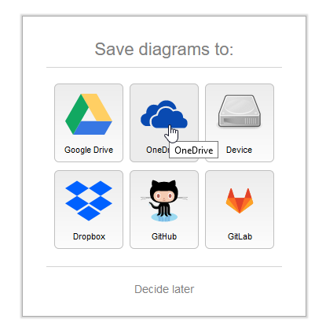
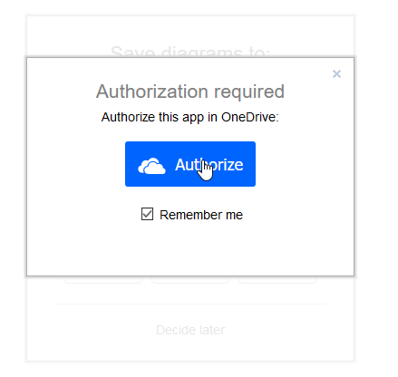
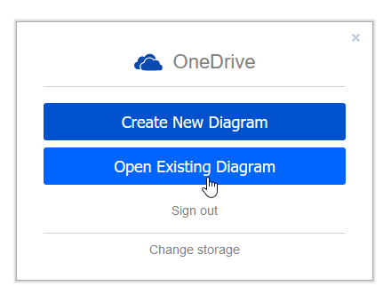
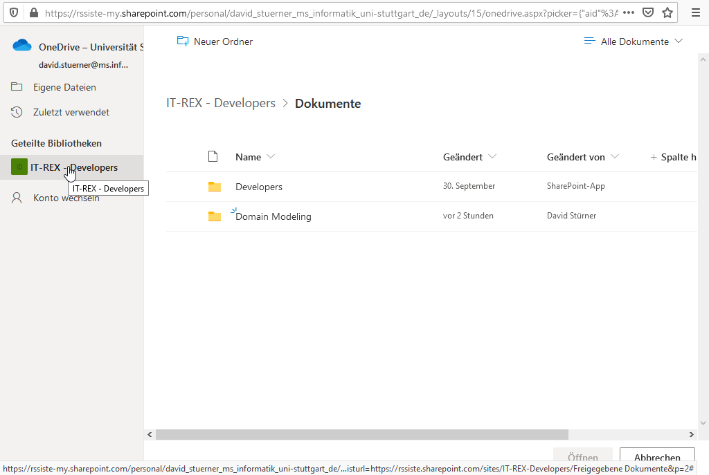
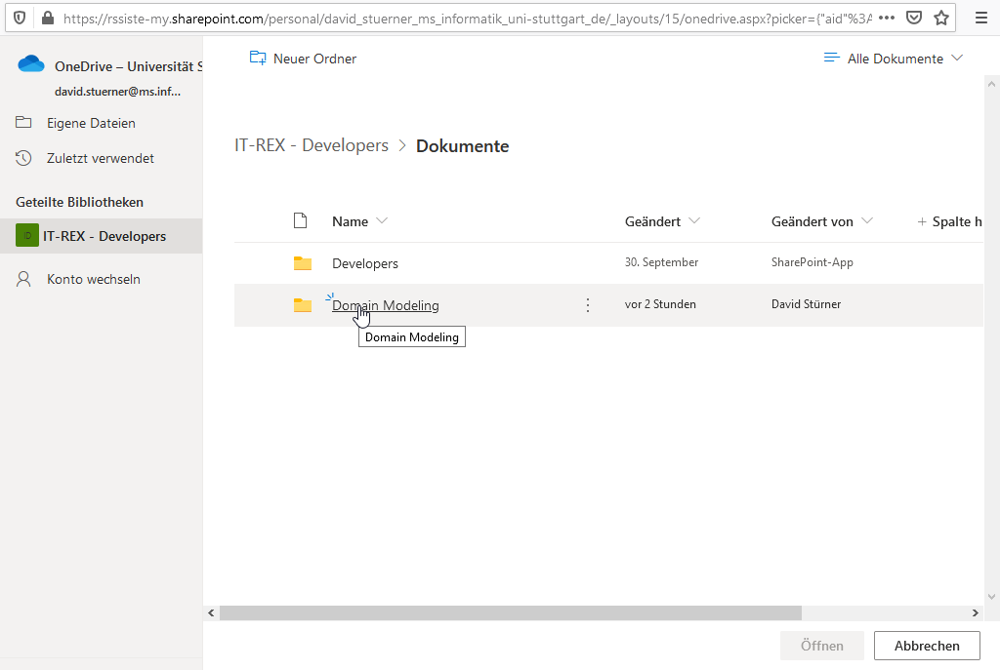
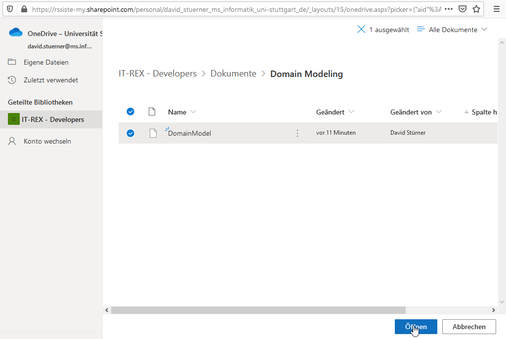

# How to access the current Models:

Open [draw.io](https://app.diagrams.net/) in your Browser.

Choose OneDrive as storage location and access the model from the IT-Rex Sharepoint as demonstrated in the following screenshots.

**Important note:** Some team members are not automatically subscribed to the 'IT-REX - Developers' Sharepoint folder, this has to be done manually first.

