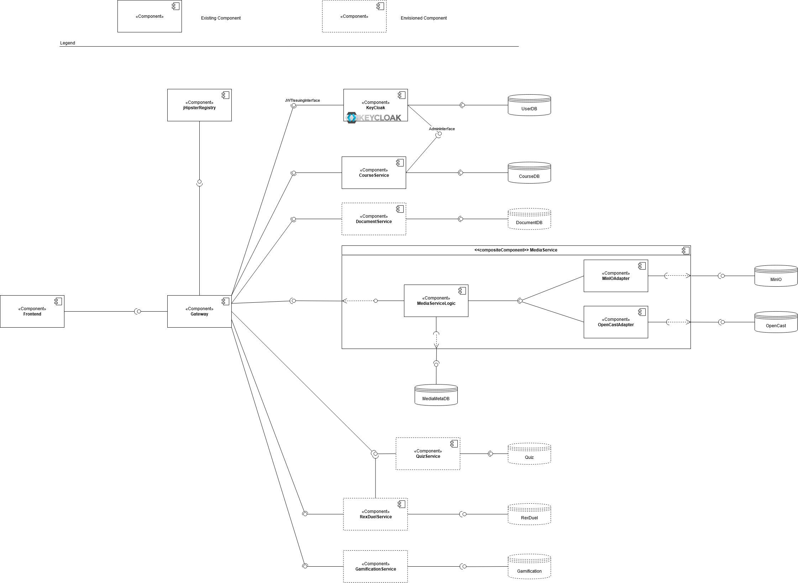

This page describes general thoughts and design decisions that influenced the architecture. It further desribes the architecture from a static viewpoint as an outcome of these architectural decisions.

ToC: 
1. [Overview](#Overview)
2. [Design Decisions](#Design-Decisions)
3. [The Microservices](#The-Microservices)
    * [Client Layer](#Client-Layer)
    * [Server Layer](#Server-Layer)
    * [External Services](#External-Services)
4. [Architecture Alternatives](#Architecture-Alternatives)
5. [Retired Microservices](#Retired-Microservices)

# Overview

The following diagram shows how we envisioned the applicaton architecture, being split up in individual microservices. It also shows the current state of implementation differing between components that are already running and planned ones.

For a better understandability, each (intended) microservice will be explained in a section below: See [The Microservices](#The-Microservices).

# Design Decisions

This section gives an overview about the major design decisions regarding the system structure. Some more details can be found in [Architecture Alternatives](#Architecture-Alternatives).

## Microservices Architecture

In order to enable horizontal scaling for the IT-Rex application, a Microservices Approach was chosen. For a good read on Microservices, see the [Blog by Martin Fowler](https://martinfowler.com/articles/microservices.html). It states that "a component is a unit of software that is independently replaceable and upgradeable".

## Technology Stack

The architecture was strongly influenced by the choice of [JHipster Microservices](https://www.jhipster.tech/microservices-architecture/) for implementing the microservices. The microservices are Spring Boot applications configured to receiving HTTP requests via a Gateway-Service and registering with the JHipster Registry. All services can be generated with JHipster-Tools and can then equipped with the implemented business logic. 

The Frontend is implemented with React and brought to Web, Android and iOS devices via Expo. The core concept is a single repository approach for code ruse on all target platforms. 

See more:
* [JHipster Microservices](./Development--How-to-JHipster-Microservices)
* [Cross Platform Framework for Frontend](./Technical-Research--Cross-Platform-Framework)
* [UI Design and Implementation Strategy and Tools](./Development--UI-Design-and-Implementation-Strategy-and-Tools)

## Component Integration and Communication

Microservices only provide HTTP interfaces. Generally, we want to avoid that services communicate with each other: Service-to-service communcation would only be necessary if data has to be replicated or shared between services, or delegated to other services. While in exceptional cases, we allow delegation to other services, we do not want to make use of shared data. Reason: With only HTTP as communication interface, we cannot replicate data ensuring consistency. If this changes, a more reliable, transactional way of service-to-service communication would have to be established, see e.g. the [Saga Pattern](https://microservices.io/patterns/data/saga.html).

Exceptional cases for delegation to other services are: 
* The Course Service will have to delegate the creation of user roles to keycloak, see [Course Service](#Course-Service).
* [to be implemented] Likely, the RexDuel Service will make use of the Quiz Service to respond to requests.

## Known Limitations
* **No shared data**: For all data, there should be a single source of truth. Data is not being replicated between services. Only exception: Nothing in IT-REX can happen "outside a course", e.g. videos, pdfs, quizzes, ... ca only be uploaded/created in a course structure. Consequence: **All microservices store course IDs for all entities.** This als serves to implement access control, as authorization is enforced on course level. 
* **Synchronous respones**: As opposed to other microservice architectures, we do not have a message bus for asynchronous request processing. 
* **No transactional safety spanning microservices**: The Gateway-Component is responsible for request forwarding, but does not act as a mediator splitting up a request between different microservices. There is currently no transaction manager in place, that's why we avoid

## Best Practices
* When new functionality is implemented, identify the responsible microservice for the required data. 
* Whenever possible, use only a single backend call for a user action. Make any request reach a consistent state in the client application. 

# The Microservices

This section gives an overview about the intended functionality of each microservice. It also indicates which microservices already exists with a label such as: 

| :white_check_mark: RUNNING |
| -------------------------- |

| :black_square_button: FUTURE |
| ---------------------------- |

## Client Layer

The Client Layer consists of a single application component.
As the name suggests, it runs on the client's machine locally.

### Frontend
| :white_check_mark: RUNNING |
| -------------------------- |

This Component is used for displaying all the relevant information to the user.
It's main tasks are:
 * Manage user Input and forward it to the Backend for Frontend
 * Visualize Data that is received from the Backend for Frontend

With this small set of functionality, the goal was to minimize computational/logical code in order to keep the Frontend Component as light-weight as possible.
This helps to achieve a smooth User Experience, as well as better performance on the Client Layer.

## Server Layer

The Server Layer consists out of 13 Microservices that together form the Backend of the IT-Rex Application.

### Gateway
| :white_check_mark: RUNNING |
| -------------------------- |

The API Gateway is the single entry point into the system. It unites all API routes the individual microservices offers and exposes them externally to the client layer. The implementation is highly influenced by the choice of using JHipster, see: 

Its core features are:
* Identification of available services using the JHipster registry
* Load-balanced distribution of requests
* Initial authentication

### Keycloak
| :white_check_mark: RUNNING |
| -------------------------- |

Keycloak was chosen to fill the role of authentication and authorization, hence replacing our early general purpose component "User Management Service".

In order to use the application, users must be able to log-in.
Through a user's account it is possible to identify a users' courses, progress and other necessary information.
Therefore the user management service is invoked by the Frontend-Backend service.
It's tasks contain:
* Managing a User Database for IT-REX with current user information
* Holding all roles available in IT-REX, single source of truth for Authorization
* Creating Tokens to encapsulate authentication and authorization information for each user
* [Potentially in the future:] Acting as broker for external identity providers

Related Pages: 
* [User Data Model](./Application-Architecture--Data-Model--User)
* [User Access Management](./Application-Architecture--User-Access-Management)

### Course Service
| :white_check_mark: RUNNING |
| -------------------------- |

The course service provides course related information course name, details, which chapters exist, etc. It further invokes Keycloak to issue the creation of course-level roles and assign such roles to users.

| :warning: This is the only intended component with service-to-service communication. |

Another important task is to transform the invoked data into a single timeline that is split up by AdjustableTimePeriods and chapters. In order to do so, the course service is connected to a database, where course-specific information is stored persistently.

In the future, there may be some integration with external LMS. These external system may be used to fetch already existing information about courses. The main goal here is to get the courses automatically, so that lecturers do not have to explicitly create them.

Related Pages:
* [Course Data Model](./Application-Architecture--Data-Model--Course)
* [User Data Model](./Application-Architecture--Data-Model--User)
* [User Access Management](./Application-Architecture--User-Access-Management)

### Document Service
| :black_square_button: FUTURE |
| ---------------------------- |

The Document service handles all logic related to displayable documents in the application.
For the beginning, the main focus will be on handling PDF files.
Later-on, other Document formats like .pptx or similar could be supported as well.

The main functionality inside the service is the management of documents. For this, documents need to be created and stored, modified/replaced and deleted.

The Document service may be connected to an outside service via the Document Adapter. Currently this source is set up by us but in the future this could be an LMS system.

Related Pages:
* [Content Data Model](./Application-Architecture--Data-Model--Content)

### Media Service

The Media Service is very similar to the Document service, but focuses on other types of media.
The main focus here lies on video, audio and image formats like .mp4, .mp3 and .svg or .png files.

Just like the Document Service, the Media Service is invoked by the course service.
This is necessary for basic functionality like uploading and displaying videos for chapters.
When uploading, chosen files get passed to the document service, which manages the storage in its own Media Database.
Additionally, it reads from the Database in order to provide the requested Media to each user.
Modifying, Updating and adding content are other tasks that are handled inside here.

The Media service is connected to an outside service via the Media Adapter.

Related Pages:
* [Content Data Model](./Application-Architecture--Data-Model--Content)

### Quiz Service
| :black_square_button: FUTURE |
| ---------------------------- |

The Quiz service is used to get, create, modify or delete quizzes.
By providing questions and answers, along with quiz settings and meta information, quizzes can be created inside the quiz service and stored in the connected Quiz Database.

The main functionality resides in delivering a quiz object to the course service with correct questions and answers for the given context (i.e. Questions for the correct chapter in the correct course).

Depending on the context, three different modes for the returned quizzes seem to be useful:
* Lecture Quiz: This is the normal quiz that would be used in the context of a chapter inside a Course.
* Turbo Quiz: A timed Quiz that contains all questions inside a course for an exam-like feeling.
* Rex-Duel Quiz: Specified rex-duel approved questions, that are course-wide.

Related Pages:
* [Quiz Data Model](./Application-Architecture--Data-Model--Quiz)
* [Quizzes](./Quizzes)

### Rex Duel Service
| :black_square_button: FUTURE |
| ---------------------------- |

Although there is already a Quiz service that handles quiz-based logic, the Rex-Duel Service is another microservice that is invoked by the course service.
In order to provide competitive and interactive rex-duels, we chose to extract this functionality from the Quiz service and create an own service instead.

Simply spoken, the Rex Duel Service sends a request to the Quiz Service, which in turn returns a rex-duel quiz.
The returned rex-duel quiz is just a data object without the necessary logic to play against other users.

This is where the Rex Duel Service comes into place.
The game-logic is implemented here and storing of the session progress and other meta-data relevant for the rex-duel is handled in a separate database that is connected to this service.

Related Pages:
* [The Story of IT Rex](./Gamification--The-Story-of-IT-Rex)
* [Ranking and Scoring](./Gamification--Ranking-and-Scoring-System)
* [Quizzes](./Quizzes)

### Gamification Service
| :black_square_button: FUTURE |
| ---------------------------- |

The Gamification Service is the entry point for gamification-based requests.
It's main goal is to combine all underlying, more specific gamification services.
In order to do so, incoming requests get processed and the logic inside the Gamification Service then decides which more specific services need to be invoked.

To fulfill a set of gamification aspects, a combination of following components may be implemented incrementally:
* Scoring service
* Customization Inventory
* Customization Shop
* Ranking Service

#### Scoring Component

The Scoring component is responsible for rewards in the form of IT-Coins.
In order to do so a scoring logic will be have to established.
Things like:
* Time to finish a Quiz
* Question difficulty
* Consecutive days in a row

all might influence how the Scoring Service behaves.
But exact characteristics still have to be determined.

It is currently not clear how this component will be implemented in detail.

#### Customization Inventory

The Customization Inventory is a component where the user-specific items are managed.
IT-Rexes can be equipped with several accessories that can be bought.
After owning them, the Inventory holds these items.

#### Customization Shop

The Customization Shop is a component responsible for the web-shop like logic where IT-Rex specific accessories can be bought.
Users can spend IT-Coins in order to own inventories, which in turn can be used by the Customization inventory then.

#### Ranking Component

The Ranking component contains the logic to compare users between each other.
This could be done through various characteristics like progress and score.
By using such metrics, a ranking can be created, showing how each user has performed, compared to the others.

Related Pages:
* [The Story of IT Rex](./Gamification--The-Story-of-IT-Rex)
* [Ranking and Scoring](./Gamification--Ranking-and-Scoring-System)

## External Services

With the usage of external services, we tackle the integration on system level and application level. These two levels are not always clearly separatable, but a key indicator is:
* System level: users do not know about it - they only know IT-REX and don't see the system behind.
* Application level: users know about and benefit from the integration.

### System Level

To make use of existing platforms that already store slides and videos at universities, these platforms could be integrated on system level. I.e., instead of using an own storage solution, these applications could be included as storage for certain microservices. 

Related Pages: 
* [OpenCast](./Technical-Research--Data-Storage--OpenCast)
* [ILIAS Storage Solution](./Technical-Research--LMS--ILIAS-Storage-Solution)
* [Moodle API](./Technical-Research--Moodle-API)

### Application Level

It might be useful to implement integration to other Learning Management Systems (LMS) to reuse data from these systems or replicate data to them. Example use cases:
* Use these systems as external identity provider.
* Fetch data like course name, description, members, ... from these systems, e.g., to enable a "Create IT-REX course from existing ILIAS course"-function.
* Replicate videos and slides that have been uploaded to IT-REX into these systems (for students that don't want to use IT-REX). When using a common storage (e.g., using Ilias to store PDF files from the Document Service), data might potentially be reused without replication.

The current external Services that are considered here are the two Learning Management Systems Ilias and Moodle.

Related Pages: 
* [External Identity Providers](./Application-Architecture--User-Access-Management#external-identity-providers)
* [Moodle API](./Technical-Research--Moodle-API)
* [ILIAS API](./Technical-Research--ILIAS-API)

# Architecture Alternatives

The following architecture alternatives were considered at some point during the project. For the sake of completeness, we list them here.

## Gateway vs. Backend for Frontend

The [Backend for Frontend](https://samnewman.io/patterns/architectural/bff/) is an architectural pattern, commonly used for multi-platform scenarios.

It enables different implementations for the same backend that provides data to the Frontend Component for visualisation.
This can be helpful when functionality changes may occur, depending on parameters like the device used by the client.

Additionally, this Service is used to call the other backend Microservices.
Typically this would happen by receiving requests from the Frontend. The Backend for Frontend's tasks then consist out of:
* Validating the received inputs
* Deciding which Microservices are needed to answer the request
* Retrieving the needed Data

## Service Integration

For the sake of simplicity in implementation, RESTful APIs were chosen to integrate services and communicate with the client layer. 

In the process, GraphQL was considered but discarded due to lack of knowledge in the team an unnecessary complextiy. See more: [REST vs. GraphQL](./Technical-Research--Api-Technologies).

## Policy-based Authorization for Resources

In order to protect individual resources with fine-grained access policies, policy-based authorization is a common concept. Keycloak also supports this concept. However, we stuck to the stateless JWT concept for two major reasons:
* Interdependence on keycloak: Any microservice would have to communicate with keycloak on request-base which adds an enourmous communication overhead.
* Authorization simplicity: We do not need fine-grained access policies, because our user role model only knows three different roles on course level that decide about access to a resource. 

See: [User Access Management](Application-Architecture--User-Access-Management)

# Retired Microservices

This section lists all microservices once envisioned but never implemented including the reason for retirement.
| :x: RETIRED |
| --- |
| This is the reason. |

## LMS Adapter
| :x: RETIRED |
| --- |
| A general purpose LMS adapter for different target systems and different functionality does not fit to a microservices approach. Adapters to external system may be added as services or composed into existing services depending on need and functionality to be integrated. |

The Learning Management System (LMS) Adapter is a microservice designed to connect with external learning platforms.
For our use-case, Ilias and Moodle are two prime examples for such external services.

This service is mainly invoked by the authentication service and the course service.
In order to process user information that is managed in the external learning management systems, an integration is needed and handled inside this microservice.
Fetching the up-to-date user-specific data and providing it is therefore one of the main tasks.
For the course service it is necessary to check for existing information like courses and their meta-data in the LMS systems.
If those are existent, the services is able to fetch them and provide it to the course service.

**!** The LMS adapter has no further functionality than fetching data from the external system to the user management service / course service. The authentication process of the user is handled entirely within the user management service. **!**

Related Pages: 
* [Moodle API](./Technical-Research--Moodle-API)
* [ILIAS API](./Technical-Research--ILIAS-API)

## Document Adapter
| :x: RETIRED |
| --- |
| Not an indepentent service, but a layer in the [Document Servcie](#Document-Service). |

The Document Adapter connects the Document service to an outside datasource. Currently this source is set up by us but in the future this could be an LMS system.

### Media Adapter
| :x: RETIRED |
| --- |
| Not an indepentent service, but a layer in the [Media Servcie](#Media-Service). |

The Media Adapter connects the Media Service to an outside datasource. Currently this source is set up by us but in the future this could be an LMS system.
