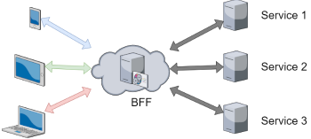

# Implementation View

This page describes general thoughts and design decisions that were used to create the [Component Diagram v2.1](https://miro.com/app/board/o9J_ldsCOKg=/?moveToWidget=3074457352019930466&cot=12).

## Application Architecture

In order to enable horizontal scaling for the IT-Rex application, a Microservices Approach was chosen. For a good read on Microservices, see the [Blog by Martin Fowler](https://martinfowler.com/articles/microservices.html). It states that "a component is a unit of software that is independently replaceable and upgradeable".

The following Diagram shows how the Domain was split up into smaller functional components, the Microservices and their interactions.

For a better understandability, each Microservice will be explained in a section below.
Afterwards, another section covering general information can be found, that is not bound to single Microservices.

## Client Layer

The Client Layer consists of a single Component.
As the name suggests, it runs on the client's machine locally.

### Frontend
This Component is used for displaying all the relevant information to the user.
It's main tasks are:
 * Manage user Input and forward it to the Backend for Frontend
 * Visualize Data that is received from the Backend for Frontend

With this small set of functionality, the goal was to minimize computational/logical code in order to keep the Frontend Component as light-weight as possible.
This helps to achieve a smooth User Experience, as well as better performance on the Client Layer.

## Server Layer

The Server Layer consists out of 13 Microservices that together form the Backend of the IT-Rex Application.

### Frontend-Backend Service
The [Backend for Frontend](https://samnewman.io/patterns/architectural/bff/) is an architectural pattern, commonly used for multiplatform scenarios.

It enables different implementations for the same backend that provides data to the Frontend Component for visualisation.
This can be helpful when functionality changes may occur, depending on parameters like the device used by the client.

Additionally, this Service is used to call the other backend Microservices.
Typically this would happen by receiving requests from the Frontend. The Backend for Frontend's tasks then consist out of:
* Validating the received inputs
* Deciding which Microservices are needed to answer the request
* Retrieving the needed Data

To implement this pattern an API language must first be agreed upon.
Related Pages: 
* [REST vs GraphQL](./Technical-Research--Api-Technologies)

We use this to integrate the services together and to bring the data into a usable format for the frontend.

### User Management Service

In order to use the application, users must be able to log-in.
Through a user's account it is possible for us to identify a users' courses, progress and other necessary information.
Therefore the user management service is invoked by the Frontend-Backend service.
It's tasks contain:
* Filling the User Database of IT-Rex with current user information
* Fetching Data from the LMSAdapter for the specific User
* Enriching this data with IT-Rex specifics (e.g. roles)
* Authentication / Providing Access
* Authorization of users inside the system

// Needs Clarification
In order to validate / compare credentials with already existing external systems, the LMS Adapter is invoked, which is another microservice, specifically designed to handle such functionality.

In addition this service is also responsible for authorizing users through roles.
All of this may be implemented via KeyCloak.

Related Pages: 
* [User Data Model](./Application-Architecture--Data-Model--User)
* [User Access Management](./User-Access-Management)

### LMS Adapter

The Learning Management System (LMS) Adapter is a microservice designed to connect with external learning platforms.
For our use-case, Ilias and Moodle are two prime examples for such external services.

This service is mainly invoked by the authentication service and the course service.
In order to process user information that is managed in the external learning management systems, an integration is needed and handled inside this microservice.
Fetching the up-to-date user-specific data and providing it is therefore one of the main tasks.
For the course service it is necessary to check for existing information like courses and their meta-data in the LMS systems.
If those are existent, the services is able to fetch them and provide it to the course service.

**!** The LMS adapter has no further functionality than fetching data from the external system to the user management service / course service. The authentication process of the user is handled entirely within the user management service. **!**

Related Pages: 
* [Moodle API](./Technical-Research--Moodle-API)
* [ILIAS API](./Technical-Research--ILIAS-API)

### Course Service

The course service is the main service for processing and providing information that belongs to a course.
It is invoked by the Frontend-Backend service.
Based on incoming requests, the following services are invoked by the course service itself in order to provide the necessary data:
* Document Service
* Media Service
* Quiz Service
* RexDuel Service

The information provided by the above listed services is then used inside the course service to fulfill tasks like visualizing and publishing certain contents.
Another important task is to transform the invoked data into a single timeline that is split up by chapters.
In order to do so, the course service is connected to a database, where course-specific information is stored persistently.

Furthermore, there is a connection to the LMSAdapter. This service can be invoked in order to fetch already existing information about the user. The main goal here is to get the courses automatically, so that the lecturer does not have to explicitly create them.

Related Pages:
* [Course Data Model](./Application-Architecture--Data-Model--Course)

### Document Service

The Document service is invoked by the course service and handles all logic related to displayable documents in the application.
For the beginning, the main focus will be on handling PDF files.
Later-on, other Document formats like .pptx or similar could be supported as well.

The main functionality inside the service is the management of documents. For this, documents need to be created and stored, modified/replaced and deleted.

Related Pages:
* [Content Data Model](./Application-Architecture--Data-Model--Content)

### Media Service

The Media Service is very similar to the Document service, but focuses on other types of media.
The main focus here lies on video, audio and image formats like .mp4, .mp3 and .svg or .png files.

Just like the Document Service, the Media Service is invoked by the course service.
This is necessary for basic functionality like uploading and displaying videos for chapters.
When uploading, chosen files get passed to the document service, which manages the storage in its own Media Database.
Additionally, it reads from the Database in order to provide the requested Media to each user.
Modifying, Updating and adding content are other tasks that are handled inside here.

Related Pages:
* [Content Data Model](./Application-Architecture--Data-Model--Content)

### Quiz Service

The Quiz service is used by the Course service in order to get, create, modify or delete quizzes.
By providing questions and answers, along with quiz settings and meta information, quizzes can be created inside the quiz service and stored in the connected Quiz Database.

The main functionality resides in delivering a quiz object to the course service with correct questions and answers for the given context (i.e. Questions for the correct chapter in the correct course).

Depending on the context, three different modes for the returned quizzes seem to be useful:
* Lecture Quiz: This is the normal quiz that would be used in the context of a chapter inside a Course.
* Turbo Quiz: A timed Quiz that contains all questions inside a course for an exam-like feeling.
* Rex-Duel Quiz: Specified rex-duel approved questions, that are course-wide.

Related Pages:
* [Quiz Data Model](./Application-Architecture--Data-Model--Quiz)
* [Quizzes](./Quizzes)

### Rex Duel Service

Although there is already a Quiz service that handles quiz-based logic, the Rex-Duel Service is another microservice that is invoked by the course service.
In order to provide competitive and interactive rex-duels, we chose to extract this functionality from the Quiz service and create an own service instead.

Simply spoken, the Rex Duel Service sends a request to the Quiz Service, which in turn returns a rex-duel quiz.
The returned rex-duel quiz is just a data object without the necessary logic to play against other users.

This is where the Rex Duel Service comes into place.
The game-logic is implemented here and storing of the session progress and other meta-data relevant for the rex-duel is handled in a separate database that is connected to this service.

Related Pages:
* [The Story of IT Rex](./Gamification--The-Story-of-IT-Rex)
* [Ranking and Scoring](./Gamification--Ranking-and-Scoring-System)
* [Quizzes](./Quizzes)

### Gamification Service\*

The Gamification Service is the entry point for gamification-based requests.
It's main goal is to combine all underlying, more specific gamification services.
In order to do so, incoming requests get processed and the logic inside the Gamification Service then decides which more specific services need to be invoked.

To fulfill a set of gamification aspects, a combination of following services may be invoked:
* Scoring service
* Customization Inventory
* Customization Shop
* Ranking Service

With this design, we are able scale and extend the gamification functionality, because new services can easily be added. This is especially important, because the extent of gamification may change later on.

Related Pages:
* [The Story of IT Rex](./Gamification--The-Story-of-IT-Rex)
* [Ranking and Scoring](./Gamification--Ranking-and-Scoring-System)

### Scoring Service\*

The Scoring service is responsible for rewards in the form of IT-Coins.
In order to do so a scoring logic will be have to established.
Things like:
* Time to finish a Quiz
* Question difficulty
* Consecutive days in a row

all might influence how the Scoring Service behaves.
But exact characteristics still have to be determined.

It is currently not clear how this service is exactly handled.
Although it is not shown in the component diagram, there probably will be a connection towards the Course Service when this gets implemented in order to check for finished Videos, Quizzes and other course content.

Related Pages:
* [The Story of IT Rex](./Gamification--The-Story-of-IT-Rex)
* [Ranking and Scoring](./Gamification--Ranking-and-Scoring-System)

### Customization Inventory\*

The Customization Inventory is a service where the user-specific items are managed.
IT-Rexes can be equipped with several accessories that can be bought.
After owning them, the Inventory holds these items.

Related Pages:
* [The Story of IT Rex](./Gamification--The-Story-of-IT-Rex)

### Customization Shop\*

The Customization Shop is a service responsible for the web-shop like logic where IT-Rex specific accessories can be bought.
Users can spend IT-Coins in order to own inventories, which in turn can be used by the Customization inventory then.

Related Pages:
* [The Story of IT Rex](./Gamification--The-Story-of-IT-Rex)

### Ranking Service\*

The Ranking Service contains the logic to compare users between each other.
This could be done through various characteristics like progress and score.
By using such metrics, a ranking can be created, showing how each user has performed, compared to the others.

Related Pages:
* [The Story of IT Rex](./Gamification--The-Story-of-IT-Rex)
* [Ranking and Scoring](./Gamification--Ranking-and-Scoring-System)

## External Services

The current external Services that are considered are the two Learning Management Systems Ilias and Moodle.
One of the main reasons for integrating them is fetching user information in order to:
* Populate our database with users, corresponding roles and meta-Information
* Refresh/Update available user information in order to get the latest state
* Authenticate users

On the other hand, this integration may allow us to fetch study-specific information like attended courses for students and managed courses for lecturers.

Related Pages: 
* [Moodle API](./Technical-Research--Moodle-API)
* [ILIAS API](./Technical-Research--ILIAS-API)

---
##### \* The Gamification Service and invoked Services are in an early phase of idea-finding and are not complete. Thus they may change in their functionality and connections to other services.
