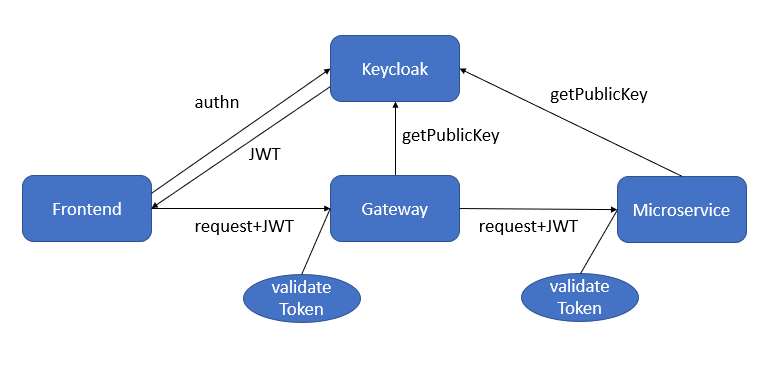
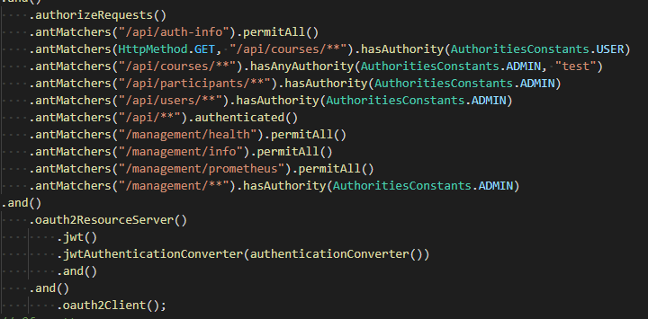

# Security concept
The security concept is based on OAuth2.0, OpenID Connect (OIDC) and JSON Web Tokens (JWT, pronounced: [dʒɒt], „jot“).

OAuth2.0 defines the following roles (for further details see [OAuth2.0 roles](https://tools.ietf.org/html/rfc6749#section-1.1)):
- resource owner - an entity capable of grantin acces to a protected ressource
    - => e.g. a lecturer
- resource server - the server hosting the protected resources, access decision based on access tokens
    - => a microservice
- client - an application making protected resource requests on behalf of a user
    - => frontend
- authorization server - a server issuing access tokens to the client
    - => keycloak

Helpful links:
- JWT documentation and token debugger [jwt.io](https://jwt.io/)
- Spring security reference [Spring security reference](https://docs.spring.io/spring-security/site/docs/current/reference/html5/)
- The OAuth 2.0 Authorization Framework [RFC 6749](https://tools.ietf.org/html/rfc6749)
- The OAuth 2.0 Authorization Framework: Bearer Token Usage [RFC 6750](https://tools.ietf.org/html/rfc6750)

## Authentication (authn) and Authorization (authz) flow
This concept is implemented based on OIDC and JWT with Spring security and keycloak. Spring security provides mechanisms to protect resources represented as REST endpoint in the Spring security configuration (SecurityConfiguration.java).

If a user wants to acces a protected resource, the user authenticates at keycloak with his user credentials. In exchange keycloak sends an access token implemented as JWT. 
Now the user is enabled to access the protected ressource by sending the request to the respective microservice alonside with the JWT. 
The JWT is stateless and self-contained. The microservice can verify the claims (e.g. username, roles) contained in the token with the help of a signature based on public key cryptography (in our case RS256). The service can retrieve the necessary public key from keycloak with a defined REST endpoint.

This flow is visualized in the following figure:

This flow enables a decentral authorization enforcement, which allows better scalability due to the reduction of needed communication to a minimum.
## Architectural alternatives
- OAuth2.0 and Spring security offer a mechanism called **opaque** token verfication. In this case the access tokens can be verified in an [OAuth2.0 introspection endpoint](https://tools.ietf.org/html/rfc7662) on an authorization service. It provides benefits in terms of security but introduces communication overhead and the introspection endpoint as performance bottleneck. Therefore we do not use this approach. If needed at a later point of time, both approaches can be combined/used in parallel for different use cases.
- Keycloak provides a uma-compliant **policy based** approach for authz where keycloak acts as **central** [authorization service](https://www.keycloak.org/docs/latest/authorization_services/index.html). In this scenario each request is intercepted by a policy enforcer in the resource server, which delegates the request to the authz service. The authz service evaluates the currently valid policy and informs the policy enforcer about the result. It provides benefits in terms of security and flexibility in access rights, but introduces communication overhead, complexity and the authz service as performance bottleneck. Therefore we do not use this approach.
- As architectural pattern we could introduce a central gateway or BFF as "authz" firewall in order to implement the authz in a central way. This would reduce the complexity of the decentral enforcement as well as ressource overhead for verification in each microservice. Due to the limitations of the JHipster "architecture" we decided to reduce inter-microservice communication to an absolute minimum. Therefore we do not use the approach at the moment.
## Spring security examples
For more details see [Spring security reference](https://docs.spring.io/)

Security Config example:
- URI based
- paths can be matched
- HttpMethod based

Same mechanisms can be applied annotation based:

## Role-based Authorization

We have three system roles (Roles are typically assigned once and rarely changed):

- Admin
- Lecturer
- Student

And three course roles (Roles will be added and changed when using the IT-REX platform):

- Owner
- Manager
- Participant

(See all details: [User Data Model](Application-Architecture--Data-Model--User))

As different micorservices require this information for authorization, it should all be included in the JWT. Consequence: The information must be available in keycloak as issuer of the JWT. All roles (system and course level) will be implemented as roles in keycloak. The system-level roles are static: there will be only admin, lecturer and student.

The course-level roles are dynamic: For each course, there will be the above mentioned three roles that can then be assigned to a user. The CourseService encapsulates all functionality for managing a course. Therefore, these roles must be created in keycloak when creating a course. **Consequently, we have service-to-service communication between the Course Service and keycloak in order to create new roles and assign roles to users.** (Compare [Implementation View](./Application-Architecture--Implementation-View#course-service))

As all rights within an individual course depend on the course role of a user, a microserive must store the course ID of all entities and resources it stores in order to manage access in a decentral way. So for instance, the media service must store the course ID for any video it stores.

## Known Authorization Limitations

We do not have shared data between microservices. This may lead to limitations to enforcing access control if other properties than a course ID are relevant, e.g. the publication state of a content item.

Currently, there are no limitations implemented. Once implemented, they will be listed here including measures to mitigate the effect.

# Keycloak

Keycloak is used for implementing the User Access Management. Keycloak is also the issuer of the JWTs.
The keycloak instance in our CD environment is running at [https://129.69.217.173:9443/](https://129.69.217.173:9443/) (use VPN!).  
Admin credentials are username `admin` and password `admin`.

## Predefined Users/Groups/Roles

When the Keycloak instance is launched via our default Docker compose file, as in our dev environments as well as on our vServer, multiple users and groups/roles are predefined.

Roles:

- ITREX_STUDENT
- ITREX_LECTURER
- ITREX_ADMIN

Groups: (These groups assign roles to users)

- ITREX_Students (Role: ITREX_STUDENT)
- ITREX_Lecturers (Role: ITREX_LECTURER)
- ITREX_Admins (Role: ITREX_ADMIN)

Users:

- Student-User
  - Username: student
  - Password: student
  - Groups: ITREX_Students
- Lecturer-User
  - Username: lecturer
  - Password: lecturer
  - Groups: ITREX_Lecturers
- Admin-User
  - Username: itrexadmin
  - Password: itrexadmin
  - Groups: ITREX_Admins

# External Identity Providers

**State of implementation:** not implemented

**State of research:** general feasibility check with keycloak and Uni Stuttgart SAML

Keycloak is capable of acting as a broker to external identity providers. This means: Users can access IT-REX with an existing account and still authenticate with keycloak as our UAM Solution. For this purpose, the external provders must be registered in our keycloak and we must register with the respective external provider.

**General Data Flow with external identity provider:** User authenticates with external provider, and if not already existant the user will be created in the keycloak database.

Keycloak can act as Identity Broker for: **SAMLv2.0, oAuthv2.0, OpenID Connect v1.0** (see [Documentation](https://www.keycloak.org/docs/latest/server_admin/index.html#_identity_broker))

**SAML/Shibboleth IDP of University of Stuttgart:** [SAML Config](https://idp.uni-stuttgart.de/idp/shibboleth). Feasibility was tested from a technical perspective: SAML Config can be read by keycloak. Organizational boundary: keycloak / IT-REX must be registered with the university SAML so it is allowed to use it.

ILIAS may offer oAuth. However, the maturity of the implementation is a little unclear (see [Blogpost](https://docu.ilias.de/goto_docu_wiki_wpage_3521_1357.html)). Also, see https://github.com/IT-REX-Platform/Wiki/wiki/Technical-Research--LMS--ILIAS-API#getting-an-oauth2-token for more information about the ILIAS API.

In keycloak, users may have additional roles/rights. For SAML (maybe for oAuth as well), it is possible to create "mappers" in keycloak: SAML attributes can be automatically mapped to roles in keycloak.
