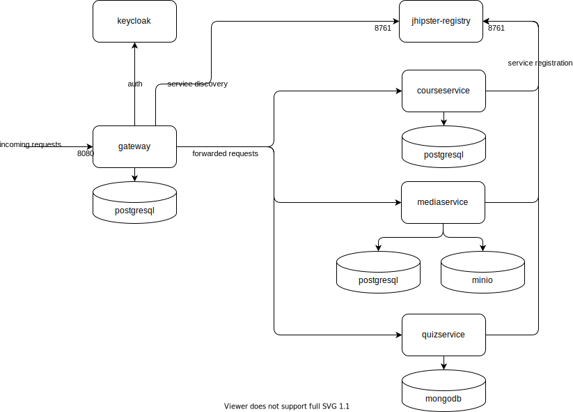

# Deployment Overview Diagram

The following backend components are currently deployed in a docker environment on our [vServer](./vServer).

(Source-File: [Sharepoint](https://rssiste.sharepoint.com/:u:/r/sites/IT-REX-Developers/Freigegebene%20Dokumente/Architecture/cd_environment?csf=1&web=1&e=c3GLOg))

In addition, the Web-Frontend ist hosted via an Apache Webserver.

# Description

This page aims to provide the reader with a quick overview of our deployment procedure.

We're hosting an always-up-to-date version of our application (based on the latest dev branch commit) on our development [vServer](./vServer).
The Registry, Gateway, microservices, KeyCloak, MinIO and other components each run as docker containers in a shared network.  
All relevant docker-compose files can be found in our the following repository: https://github.com/IT-REX-Platform/IT-Rex-deployment. 

In addition, there is a [guide for deploying IT-REX for production](./How-to-operate-IT-REX) and a [guide for running IT-REX locally](./Development--How-to-start-a-backend-service). 