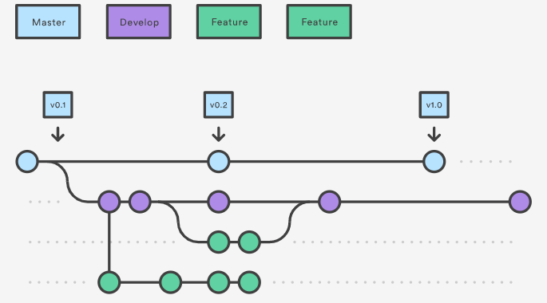
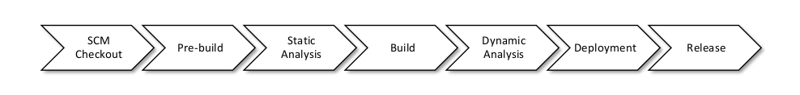

This page will present the findings from our kickoff meeting on the 15th December.
There we discussed and agreed upon some basic decisions like IDE, Git-Workflow and Technology.
These are going to be presented in the following.

# DevOps Motivation

First of all the question: Why do we want DevOps?  
The main motivation here is to maintain a stable code base and production environment.
To achieve this, we don't want a lot of manual work, instead we rely on automated methods to help us.

By using Continuous Integration, no code should be able to get into the shared code-base that does not fulfill our defined quality standards.
Each commit therefore needs to pass the compiler, tests and other steps explained later to get integrated.

# IDE

In order to bring peace and harmony to our code base, developers will be enforced to use certain styling guidelines.
The easiest way for ensuring the same stylings and to prevent technical difficulties, we decided on using the same IDE for every developer.

For frontend development this is: [Visual Studio Code](https://code.visualstudio.com/).  
For backend development this is: [IntelliJ IDEA](https://www.jetbrains.com/de-de/idea/).  

Furthermore, this will enable us to easily help other developers when facing problems through remote screen sharing or similar things.

# Git-Workflow

In order to work on different topics in parallel we also decided on a workflow.
For this, we chose an extension of the [Feature Branch Workflow](https://www.atlassian.com/de/git/tutorials/comparing-workflows/feature-branch-workflow). Here, some elements from the [Git-flow workflow](https://www.atlassian.com/de/git/tutorials/comparing-workflows/gitflow-workflow) were added.
Our current approach works as follows:

Development is done in **Feature-Branches**. A possibility for a naming convention would be to use the jira issue number as a name here.
When the Feature is implemented and tested a pull request is created.
After the pull-request is reviewed and accepted, the code then gets merged into the **develop** branch.
The **develop** branch then contains the latest version of software.
 
Up until this point, we don't do anything different than described in the [Feature Branch Workflow](https://www.atlassian.com/de/git/tutorials/comparing-workflows/feature-branch-workflow).
 
In addition, we want a **main** branch. Nobody pushes directly to the main branch. This step is only done through our CI environment.

With this approach, we want to guarantee for a stable production environment (the codebase on **main**). Whereas the pre-production code from the **develop** branch is deployed and released for testing-purposes. This helps to see the latest changes in a production-like environment before pushing them to the production environment.

# CI-Environment

After evaluating various providers, we decided to use Jenkins as our CI-Environment.
The main reason is that there is no cap on how many build minutes we are able to use without paying for them.

Jenkins provides so-called pipelines. A Jenkins Pipeline is a suite of plugins that helps us to achieve automated actions that we want to perform with / on our code.
Such a pipeline exists for every branch that we have in all of our projects.
Each commit is automatically detected and a pipeline is triggered.

As presented previously in the Git-Workflow section, we want to integrate Feature-Branches via Pull requests.
When such a pull request is created, Jenkins also auto-detects it and runs a pipeline for the current code-base.

*What does the pipeline do?*  
We don't really want to get into too much detail, but each pipeline consists of several steps, mostly divided into the following parts:

*What does this mean?*  
A brief overview of the several stages:

- ### SCM Checkout
This is basically the "git pull" command. Here, the pipeline gathers the latest changes for the corresponding branch or pull request that it is acting upon.
On this code basis, later steps are applied.

- ### Pre-build
In order to work with the code, it is possible that some preparations need to be done.
For the frontend for example, 'npm install' is executed in this stage in order to get the latest dependencies.

- ### Static Analysis
After checking out the code, static analysis is done here. This are typically tests that don't require compilation like codestyle checks.

- ### Build
After the static tests have passed, we know that the code looks as we want it to look. So the next step is to build it.
Typically the code is compiled here and needed helper-processes are executed.

- ### Dynamic Analysis
The dynamic analysis stage is performing the tests that require the compiled and built version of the code.
This includes several different testing techniques. Some of them are unit tests, smoke tests and integration tests.

- ### Deployment
The last step of our pipeline is the Deployment. Depending on some conditions, the current code-base is deployed so that it is available and can be reached.
This stage is currently only executed if we are on the *main* branch.

- ### Release
This stage is only executed when we are on the Develop Branch and the Pipeline Build is triggered manually (by a user).
With this approach, we want to have control over when the code from the Develop branch is merged into the main branch.

---

Currently we decided on a sequential execution of pipeline stages. This means that each stage is executed when the previous one has finished.
But only if the previous stage has finished succesfully(!).
This also means that if a pipeline fails, further actions are not executed.

Depending on the build result, indicators are shown in the Jenkins Frontend and for Pull-Requests you can see the status of the corresponding build inside the Pull Request on the Github site too.