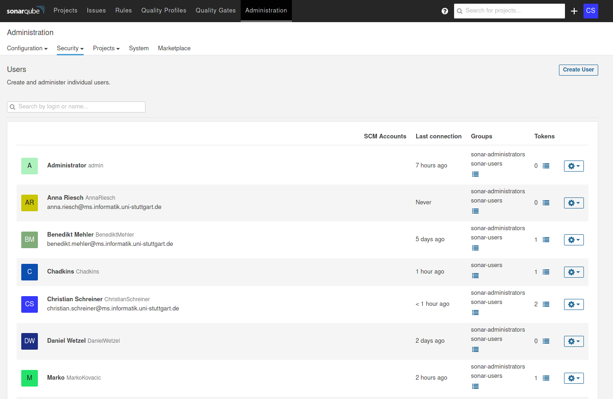
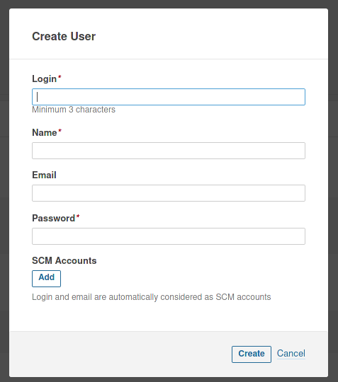
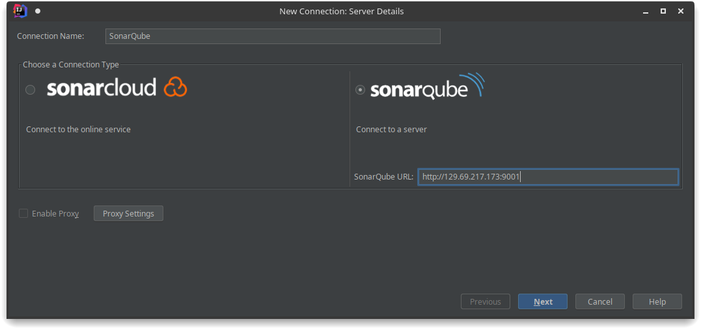
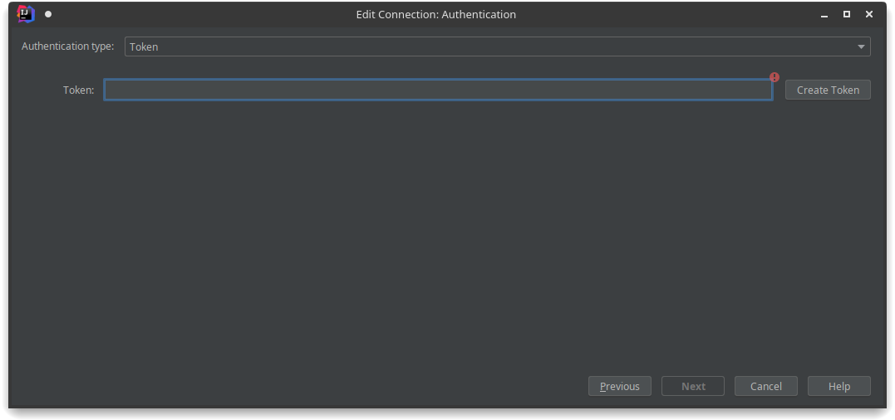
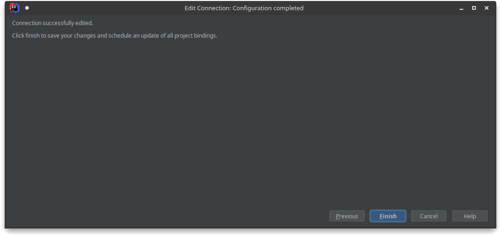
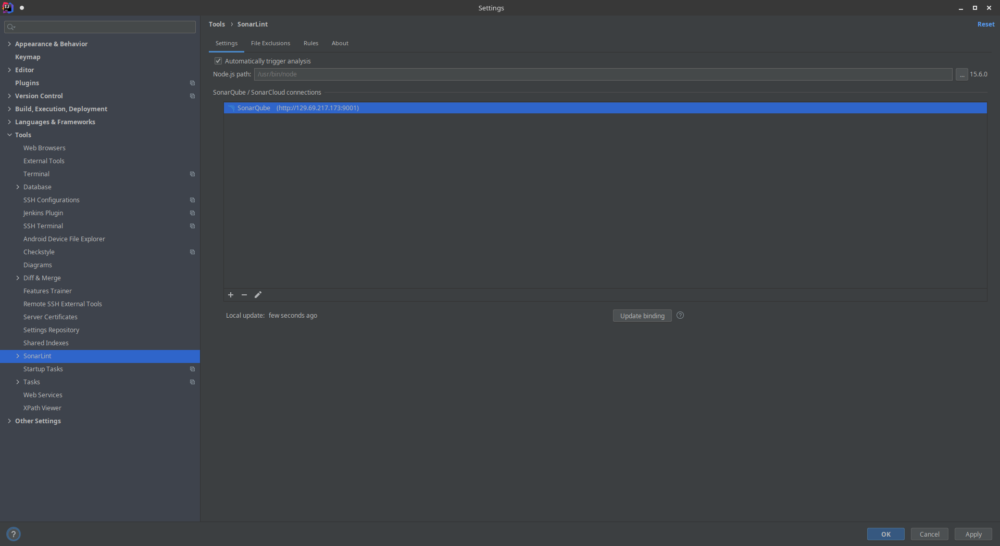

<!-- omit in toc -->
# Setup dev environment

This page is about setting up the the tools that are needed for the local static code analysis. This is necessary because SonarQube is only triggered when a commit is merged onto the dev branch. 

## Checkstyle

This is already documented [here](./Development--Quality-Assurance-and-Methods--Static-Code-Analysis--Backend###Checkstyle).

## SonarQube

Everyone of us needs an account (except David maybe🤪)
1. Go to [SonarQube](http://129.69.217.173:9001)
2. Login with the username "admin" and the password "ContactChristianForThat42"
3. Got to [Users](http://129.69.217.173:9001/admin/users) 
4. Click on "Create User" and fill in that stuff. You can ignore the SCM stuff 
5. Congratulations:)

## SonarLint

1. Navigate to: File → Settings → Plugins
2. Search for SonarLint and install the plugin
3. Navigate to: File → Settings → Tools → SonarLint
4. Add a new SonarQube connection by clicking on the "+"
5. Adjust the scan scope if necessary
6. Choose "SonarQube" and enter the url to our instance 
7. Generate your token [here](http://129.69.217.173:9001/account/security) or use your username and password 
8. Thats it (almost) 
9.  Now click on "Update binding"