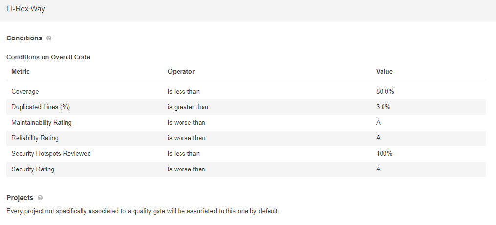

<!-- omit in toc -->
# Setup dev environment

This page is about setting up the the tools that are needed for the local static code analysis. This is necessary because SonarQube is only triggered when a commit is merged onto the dev branch. 

 
 
 [Image Source](https://docs.sonarqube.org/latest/)

- [Frontend](#frontend)
  - [ESLint and Prettier](#eslint-and-prettier)
  - [Code Coverage](#code-coverage)
- [Backend](#backend)
  - [SonarQube](#sonarqube)
  - [Checkstyle](#checkstyle)
  - [SonarLint](#sonarlint)

## Frontend

### ESLint and Prettier

Read [ESLint and Prettier](./Development--Quality-Assurance-and-Methods--Coding-Conventions--ESLint-and-Prettier##VSCode)

### Code Coverage

Read [Code Coverage](./Development--Quality-Assurance-and-Methods--Testing--Code-Coverage)

## Backend

### SonarQube

With SonarQube is a tool to automatically review Code to detect bugs, code smells and vulnerabilities. It can integrate with the existing workflow to enable continuous code inspection across the project branches and pull requests. [1](https://docs.sonarqube.org/latest/)

Everyone of us needs an account (except David maybe🤪)
1. Go to [SonarQube](http://129.69.217.173:9001)
2. Login with the username "admin" and the password "ContactChristianForThat42"
3. Got to [Users](http://129.69.217.173:9001/admin/users) 
4. Click on "Create User" and fill in that stuff. You can ignore the SCM stuff 
5. Congratulations:)

#### Quality Gate

Quality Gates enforce a defined quality policy to determine whether the project is ready for release. For this purpose, different coditions can be defined, which are measured against the project.

Here the recommended Sonar-Way Quality Gate was chosen, with the difference that not only the newly added code is analysed, but the overall code. The quality gate is called IT-Rex Way and can be edited if necessary. Please discuss with the team before making any changes. 
The Qulity Gate can be found at this [link](http://129.69.217.173:9001/quality_gates/show/AXb2fp14nHCoTEaPRxpo) and contains the following rules: 

 

### Checkstyle

This is already documented [here](./Development--Quality-Assurance-and-Methods--Static-Code-Analysis--Backend###Checkstyle).

### SonarLint

After the SonarQube scanner has analysed the code, the results are sent to the SonarQube server and to the SonarLint plugin integrated in Intellij. With this feedback you can catch and fix issues before they get to the repository. [1](https://docs.sonarqube.org/latest/)

1. Navigate to: File → Settings → Plugins
2. Search for SonarLint and install the plugin
3. Navigate to: File → Settings → Tools → SonarLint
4. Add a new SonarQube connection by clicking on the "+"
5. Adjust the scan scope if necessary
6. Choose "SonarQube" and enter the url to our instance 
7. Generate your token [here](http://129.69.217.173:9001/account/security) or use your username and password 
8. Thats it (almost) 
9.  Now click on "Update binding"

 
## Sources
- [SonarQube](https://docs.sonarqube.org/latest/)
