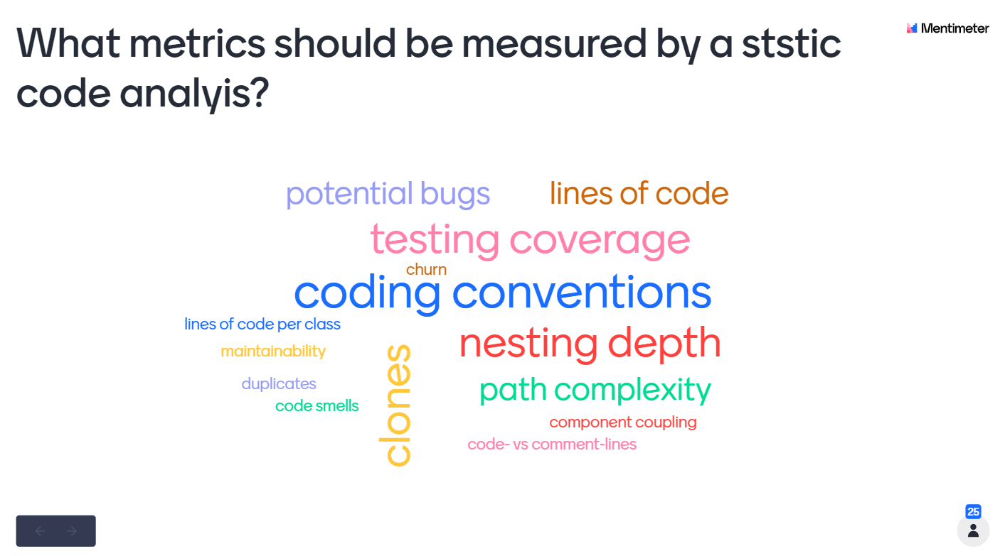

## Backend: Java/Spring Boot 

In order to find out which metrics in the area of Static Code Analysis are considered necessary and useful by the developers of the team, a survey was launched using Mentimeter.  

These are the results: 

Ranking:

1. Code conventions
2. Nesting depth
3. Testing coverage 
3. Path complexity 
4. Potential bugs
5. Code Smells
    1. Lines of code (per class)
    2. Duplicates (Clones)
    3. Code vs comment lines
6. Maintainability
7. Chrun
8. Component coupling 

### Code Conventions
To check if the written source code in the backend conforms to the  [Sun Code Conventions](https://introcs.cs.princeton.edu/java/11style/codeconventions-150003.pdf)
the development environment Intellij and the Plugin Checkstyle are used. 

"Checkstyle is a development tool to help programmers write Java code that adheres to a coding standard. It automates the 
process of checking Java code to spare humans of this boring (but important) task. This makes it ideal for projects that 
want to enforce a coding standard." [2](https://checkstyle.sourceforge.io/index.html)

Intellij is a leading Java IDE with built-in code inspection and analysis. With the additional help of the Checkstyle Plugin,
Intellij takes care of the correct formatting, e.g. with regard to indentation (In relation to the Sun Code Conventions), 
and marks violations of the Google Java Code Guidelines. A list of what conventions Checkstyle checks can be found [here](https://checkstyle.sourceforge.io/google_style.html). 

#### Plugin installation and configuration Checkstyle

**Precondition:** Intellij is already installed and opened 
 
1. Navigate to: File &rarr; Settings &rarr; Plugins
2. Search for **CheckStyle-IDEA** and install the plugin
3. Navigate to: File &rarr; Settings &rarr; Tools &rarr; Checkstyle 
4. Select **Sun Checks** as Configuration File
5. Adjust the scan scope if necessary 

Adding the code style schema to the editor:
5. Download the sun_style.xml 
6. Navigate to:  File &rarr; Settings &rarr; Editor &rarr; Code Style
7. Import the sun_style.xml scheme as follows: 

 **&rarr; Restart Intellij**
 
 After the restart the CheckStyle Plugin automatically checks the Sun Code Conventions in the Background and marks the violations in the editor.  

 
### Bug hunting 
- Find Bugs 
- Spot Bugs 

  

## Sources
- [1] [Static Code Analysis](https://www.perforce.com/blog/sca/what-static-analysis)
- [2] [Checkstyle](https://checkstyle.sourceforge.io/index.html)
- [List of Tools for static code analysis](https://en.wikipedia.org/wiki/List_of_tools_for_static_code_analysis)
