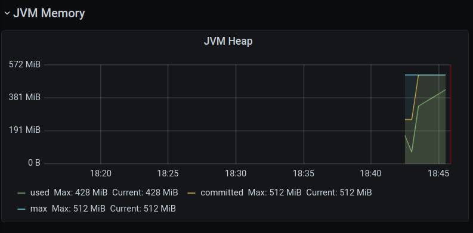

# Open Bugs

## Unprotected API routes in Media Service

(Relevant commit: MediaService/[f24830d4e17e20b57f745df94b56ad831412dde5](https://github.com/IT-REX-Platform/MediaService/blob/f24830d4e17e20b57f745df94b56ad831412dde5/src/main/java/de/uni_stuttgart/it_rex/media/config/SecurityConfiguration.java#L75))  
IT-REX hosts videos, which can be streamed from a MinIO backend through the Media Service.
The Frontend uses an HTML5 videoplayer (wrapped in expo-av) for video playback.
Our authorization model, which relies on a JWT passed in a header with every request, is incompatible with this approach as the HTML5 video player does not support defining custom headers to be sent with the video file request. While expo-av does in fact appear to offer such a property to be defined, this only works with the iOS and Android targets.

To mitigate the impact of this limitation, we chose to go with UUIDs to identify valid videos. These are at the very least hard to guess and can only be obtained through properly protected endpoints.

Possible workarounds include:

1. XMLHttpRequest (CORS) -> buffer / blob -> try to play this; may cause issues with Range functionality.
2. Pass token as URL parameter and catch this in Media Service (generally not a good idea due to browser caching / history)
3. Pass token as cookie

Options 2 & 3 require additional research into the Spring Security Configuration as retrieving and processing the JWT on these levels is being handled by generated code and dependencies exclusively, so this is not a trivial change to make (or at least not to our knowledge).

See also JIRA for open bug tickets: [IT-REX@Jira](https://it-rex.atlassian.net/jira/software/c/projects/ITREX/issues/ITREX-677?jql=project%20%3D%20%22ITREX%22%20AND%20type%20%3D%20%22Bug%22%20ORDER%20BY%20created%20DESC)

## Zuul Exceptions in Gateway when watching a video

When watching a video in the Frontend there are errors with Zuul (“Error during filtering - Filter threw Exception”) in the Gateway. They are not visible in the Frontend and the watching of videos is working correctly.

The exceptions occur every time the watching of a video is started and continuously come up while watching the video.

Perhaps this is a version incompatibility of two components that are used by Jhipster.

A logfile of the thrown exception can be found [here](https://github.com/IT-REX-Platform/Wiki/blob/main/wiki/resource/logs/zuulException.md).

See also JIRA for open bug tickets: [IT-REX@Jira](https://it-rex.atlassian.net/jira/software/c/projects/ITREX/issues/ITREX-696?jql=project%20%3D%20%22ITREX%22%20ORDER%20BY%20created%20DESC)

# Known Problems and Limitations

## Content Data Model Implementation

In the design phase, a baseline for the content data model was created in order to get an overview about the respective entities and their relationships, see: [Content Data Model](Application-Architecture--Data-Model--Content).

In the current implementation state, IT-REX supports only videos, no PDFs, audio files, etc. Additionally, as described in the [Implementation View](Application-Architecture--Implementation-View#Document-Service), the service cut between the existing Media Service (handles videos) and a potential future Document Service is not fix. During the implementation of the Media Service, the entire Content Data Model was implemented on entity-level. It demonstrates a potential solution for implementing the entire model in one service including inheritence, therefore this implementation was not removed from the code-base as a reference implementation. When decision about other media types is made, this implementation may be used, remove, or altered.

## Media Adapter

The definition of a Media Interface and implementation of an according adapter for OpenCast was started, but not finished during the project. See details here: [OpenCast in our Wiki](Technical-Research--Data-Storage--OpenCast#implementation-attempt).

## Video Upload Size

Currently the upper limit of the size of videos to upload is ~70MB. This is because of a problem with the Gateway service, which JVM Heap Memory gets over utilized with larger video files. This leads to an exception in the Gateway and an internal server error.

Screenshot from Grafana:

A logfile of the thrown exception can be found [here](https://github.com/IT-REX-Platform/Wiki/blob/main/wiki/resource/logs/heapOutOfMemory.md).
