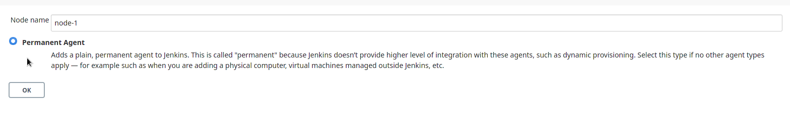
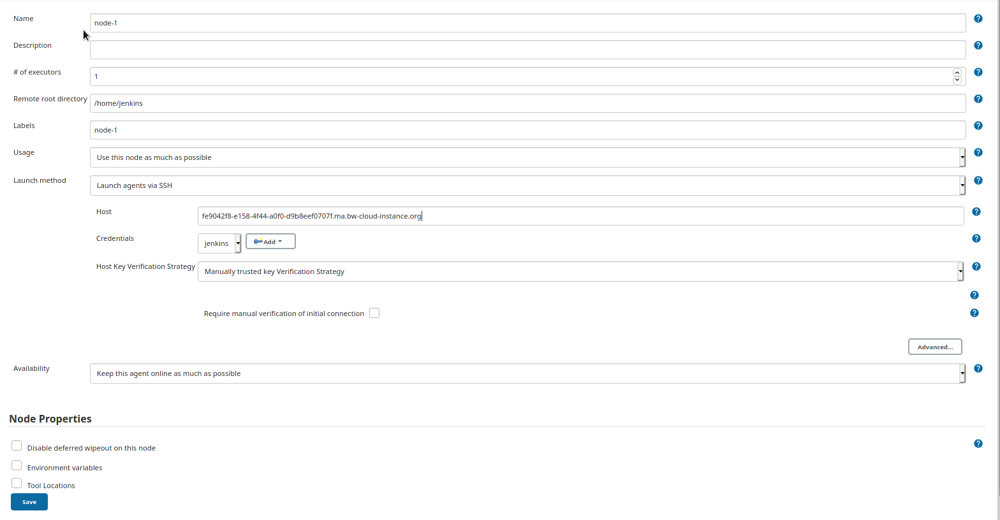

# Creating slave nodes

Adding a slave node to Jenkins is quite simple. Just run this [script](https://github.com/IT-REX-Platform/utility-scripts/blob/main/configure-slave.sh) as root on the node. 
After that open the Jenkins dashboard and click on "Manage Jenkins" then on "Manage Nodes and Clouds" then on "New Node" or follow this [link](http://129.69.217.173:8084/computer/new). Now enter a Node name and choose "Permanent Agent" or copy an existing one.

After that configure the node like this (You have to adjust the label and the Host address)

Then click on save. And hope that nothing unforeseeable happens. Jenkins launches an agent on the node now.

If the console output says "Agent successfully connected and online" you have done everything right. Congratulations!

