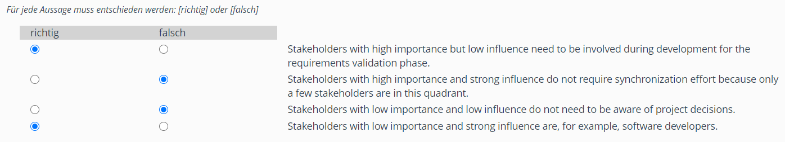
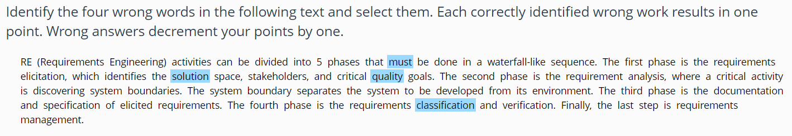
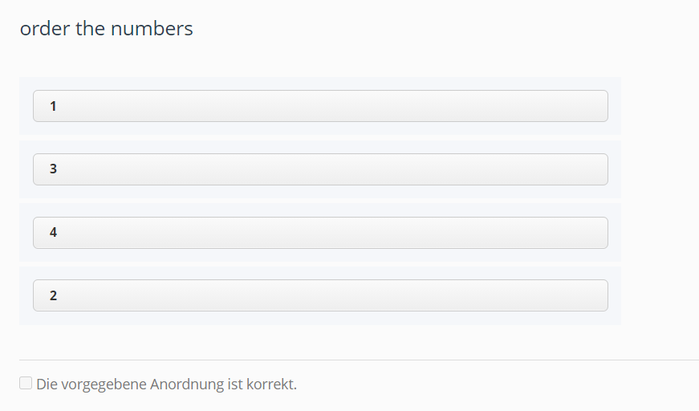
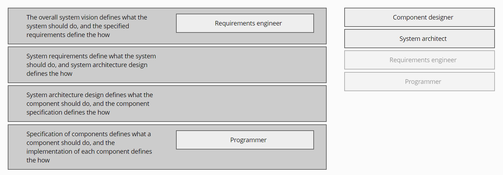
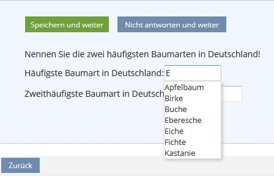

# Test Options

## Ilias
* Question Pool
* option to give participants always the same questions or random ones
* option to create an anonymous test
* test can be made available only for a limited time
* password protected
* add an info about the test
* options for exam mode -> out of scope for us?
* make the point/score system visible for the participants
* fixed or mixed order of questions
* hint system
* mandatory / optional questions
* use the answers of previous test runs
* overview of answers in the end before submitting
* notification when someone finishes a test
* set a scoring system (fully customizable) -> default: with 50% test is passed
* set an evaluation system: how to cope with incomplete or wrong answers (minus points / partial points / ...)
* if how and when participants can access their test results
* if how and when participants can access the correct test answers

## Which general options should IT-Rex quizzes provide?
ToDo

# Research for different question/answer types
Multiple and single choice questions are the simplest types of questions that should definitely be included. I think it is important to also offer other question types to cope with repetitiveness that often comes with single or multiple choice questions. It feels refreshing to have some level of interaction and this also gives an incentive to think more about the question and what you are answering. Furthermore, some questions can be stated better with other forms of question types.

## Ilias Quizzes
Ilias offers several question types with different level of interaction.
https://docu.ilias.de/data/docu/lm_data/lm_8782/Test_Assessment_38.html#d54e480

### Multiple Choice / Single Choice
* many different options here
* tell how many answers are right?

### KPrim Choice
* you have statements given and need to decide whether they are wrong or right
* it is also possible to set other names than "wrong" or "right"

Example:

### ViPLAB Question
* tests knowledge about programming languages (C, Java, etc.) with actual code
* out of scope

### Faulty Text
* you have a text given and need to find words that are wrong and mark them
* good applicability for linguistics to test vocabulary or grammar
* example uses it to test the right usage of terms and if they are understood
* possibility to give the number of mistakes or not

Example:

### Hotmap / Imagemap
* from the docu: An imagemap question is a list of coordinates relating to a specific image, created in order to provide areas with predefined solutions for the question. It is a graphical variant of a multiple choice question with single response.
* you have to upload an image and an imagemap with corresponding coordinates
* Alternatively Ilias offers a wizard to set the coordinates
* single choice and multiple choice options
* great graphical representation but quite complex to realize

Example:

### Cloze questions ("Lückentext")
* different options: free text / drop down with given answers / numerical answer (with range)

### Numerical answer
* very simple, for example for calculations
* set a range of acceptable values -> important for floating numbers

### Text subset questions ("Begriffe nennen")
* free text
* you have to type in a given amount of terms
* options to account for capital letters and [Levenshtein distance](https://en.wikipedia.org/wiki/Levenshtein_distance)

### Ordering
* vertical or horizontal
* put a given set of answers in the right order

Example (vertical):

### Classification
* you have statements and answers given and need to assign the answers to the correct statements
* 1:1 or n:n possible
* answers can be solutions for the statements, captions, other statements that have a specific relation, ...
* exact definitions of statements and answers are important here
* gives some interaction that is also applicable for touch screens (if large enough)

Example:

### Essay questions
* free text
* manual grading, but also gives options to automatically grade based on the naming of specific terms

### File Upload
* you have to simply upload a file
* manual grading but also gives the option to grade full points based on the upload itself.

### Long Menu
* alternative to cloze questions
* gives suggestions for answers in a dropdown with auto completion

Example:

### Audio recording
* you can record an audio and submit it as the answer

### STACK questions
* interesting for mathematics
* very advanced
* see https://docu.ilias.de/goto_docu_cat_4119.html

Example: https://docu.ilias.de/ilias.php?ref_id=5824&obj_id=75135&cmd=layout&cmdClass=illmpresentationgui&cmdNode=iw&baseClass=ilLMPresentationGUI

### Formula question
* type in a formula and require answers for given variables
* automatically analyze the formula and give possible solutions

## Other possible types
ToDo: think or search for other possible types that would make sense in IT-Rex

## Priorization for IT-REX

### Must Have
* Multiple Choice / Single Choice
* KPrim Choice
* Numerical answer

### Useful
* Faulty Text
* Cloze questions ("Lückentext")
* Text subset questions ("Begriffe nennen")
* Ordering
* Classification
* Essay questions

### Nice to Have
* Hotmap / Imagemap
* Formula question

### Out of scope
* ViPLAB Question
* File Upload
* Long Menu
* Audio recording
* STACK questions
