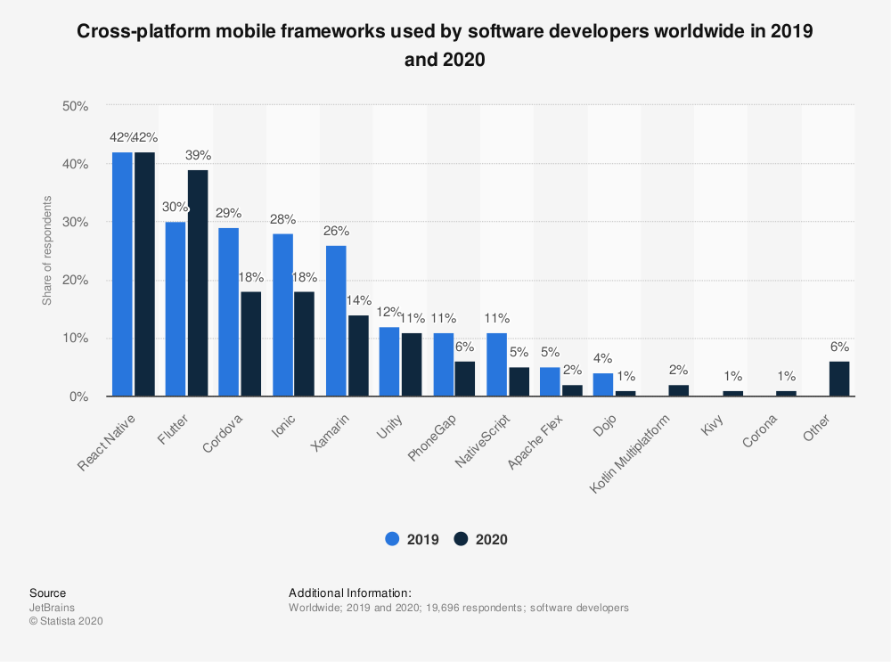

# Which OS / Browser should be supported

* Mobile Apps (iOS / Android) (1)
* Browser (1)
  * Chromium/Chrome (1)
  * Firefox (1)
  * Safari (1)
  * Edge (2)
  * Opera  (3)
  * Brave (3)
* Desktop (2)
  * Windows
  * Linux
  * MacOS

(1): Must have , (2): Optional , (3): Nice to have

# Frontend FrameWorks

# Cross Platform Frameworks

| Framework               | IDE                               | Language                   | Frameworks            | Runtime                                                 | Targets                                       | Launched | Pros       | Cons |
|-------------------------|-----------------------------------|----------------------------|-----------------------|---------------------------------------------------------|-----------------------------------------------|----------|------------|------|
| Ionic                   | VS-Code, Atom, WebStorm           | HTML, CSS, JavaScript (TS) | React, VueJs, Angular | Full screen Web browser                                 | Android, iOS, Web/PWA Desktop (electron)      | 2013     |            |      |
| Flutter (Google)        | Android Studio, VS-Code, IntelliJ | Dart                       |                       | custom graphics engine Skia (own library of UI Widgets) | Android, iOS, Desktop (alpha), Web app (beta) | 2017     | Perormance | New  |
| React Native (Facebook) | Atom, VS Code, WebStorm           | JavaScript                 | React                 | Copmiled to native UI components                        | Android, iOS, Web                             | 2015     |            |      |
| Xamarin (Microsoft)     | Visual Studio/Xamarin Studio      | C#                         | .Net                  |                                                         | Android, iOS, Desktop                         |          |            |      |

## Ionic vs Flutter

https://ionicframework.com/resources/articles/ionic-vs-flutter-comparison-guide 

##  Cross-platform mobile frameworks used by software developers worldwide in 2019 and 2020 

https://www.statista.com/statistics/869224/worldwide-software-developer-working-hours/

# Web Frameworks

## VueJs
## AngularJs
## React
