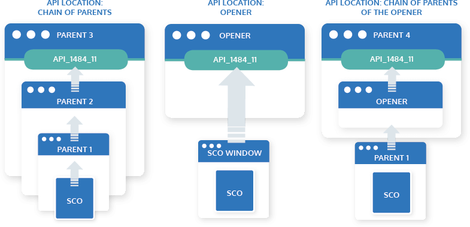

# SCORM

## What is SCORM

SCORM is a standard for eLearning courses. A SCORM compliant course can be used with different Learning Management Systems (LMS), provided the LMS is also SCOMR compliant. 

SCORM relies on HTML, CSS and Javascript to present content. This has the advantage that there are no limits on what can be created and how a course can be designed.

A Javascript API that is implemented by the LMS is used to communicate between the SCORM course and the LMS. It provides the following functions:

SCORM 2004:

``` javascript
Initialize( "" ) : bool
Terminate( "" ) : bool
GetValue( element : CMIElement ) : string
SetValue( element : CMIElement, value : string) : string
Commit( "" ) : bool
GetLastError() : CMIErrorCode
GetErrorString( errorCode : CMIErrorCode ) : string
GetDiagnostic( errocCode : CMIErrorCode ) : string
```
SCORM 1.1 / SCORM 1.2:

``` javascript
LMSInitialize( "" ) : bool
LMSFinish( "" ) : bool
LMSGetValue( element : CMIElement ) : string
LMSSetValue( element : CMIElement, value : string) : string
LMSCommit( "" ) : bool
LMSGetLastError() : CMIErrorCode
LMSGetErrorString( errorCode : CMIErrorCode ) : string
LMSGetDiagnostic( errocCode : CMIErrorCode ) : string
```

A SCORM package contain a _imsmanifest.xml_ that describes Resources, metadate and how the course is organized.
The smallest completable unit in SCORM is the "Shareable Content Object" (SCO). They may be launched in their own frame, frameset or in a pop-up window and communicate with the LMS through the provided API object. This API object is searched by the SCO wth a simple standardized algorithm. It's supposed to be in a parent window of the SCOs window.



## Sources

- [SCORM Demystified](https://www.youtube.com/watch?v=FzxNwWvmwf4)
- [Cooking up a SCORM](https://scorm.com/wp-content/assets/cookbook/CookingUpASCORM_v1_2.pdf)
- [SCORM Run-Time Environment](https://scorm.com/scorm-explained/technical-scorm/run-time/)